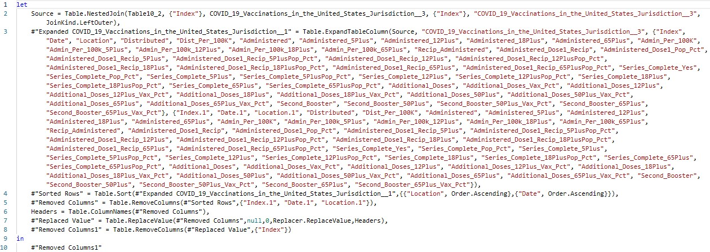

```{r setup, include=FALSE}
knitr::opts_chunk$set(echo = TRUE, message = FALSE,
                      warning = FALSE)
```

# Introduction

The purpose of this project is to produce a model that will be able to predict the amount of people who contract COVID-19 in the United States as well as predict the amount of deaths that it causes.

## What is COVID-19?

Coronavirus disease 2019 (COVID-19) is a contagious disease caused by a virus, the severe acute respiratory syndrome coronavirus 2 (SARS-CoV-2). The first known case was identified in Wuhan, China, in December 2019. The disease spread worldwide, leading to the COVID-19 pandemic.

Symptoms of COVID‑19 are variable and may imclude fever, cough, headache, fatigue, breathing difficulties, loss of smell, and loss of taste, pneumonia, dyspnea, hypoxia, respiratory failure, shock, multiorgan dysfunction, and death.

COVID-19 transmits when people breathe in air contaminated by droplets and small airborne particles containing the virus. On average, people are contagious two days before the first sign of symptoms and ten days after the first sign of symptoms. 

In mid-December of 2020, the first vaccines were made available to a limited amount of the public. The vaccines were released in a specific order to subsets of the populace. First starting with people over the age of 65 or with health conditions, then to people over the age of 18, before moving to people above the age of 12, and just recently to children age 5 and older.

## Why might this model be useful.

By comparing trends across individual states and the nation as a whole, it is possible that we could find commonalities between states with higher than average cases and deaths. In addition this could also help us identify which of the factors are most significant to the model and therefore, the pandemic. It could also reveal in what ways certain states fail in the implementation of vaccinations.

## Packages

The following packages will be used in a variety of methods to learn more about the data and construct the most accurate model possible.
```{r message=FALSE}
# Load packages
library(corrplot)
library(corrr)
library(discrim)
library(dplyr)
library(forcats)
library(ggplot2)
library(gridExtra)
library(ISLR)
library(ISLR2)
library(janitor)
library(klaR)
library(randomForest)
library(readr)
library(readxl)
library(rpart.plot)
library(tidymodels)
library(tidyverse)
library(tune)
library(vip)
library(xgboost)
```

## Data Sets 
  
This project uses a combination of four data sets containing a multitude of relevant variables the will be used as the predictors in the model that will be created.
  
The first two data sets record the historical data for COVID-19 of each state and territory within the United States while the last two data sets are estimations of each state and territory population from 2020. 

The first set of data was found at the New York Times ongoing repository of data on COVID-19 cases and deaths in the United States.
The second set of data was found at the CDC (Center for Disease Control and Prevention), and covers the overall US COVID-19 vaccine distribution and administration data at a national and jurisdiction level. Finally, the third and fourth sets of data are from the United States Census Bureau, the nation’s leading provider of quality data about its people and economy.

All of the data sets can be found in the following links:
  - [nytimes/covid-19-data]("https://github.com/nytimes/covid-19-data")
  - [COVID-19 Vaccinations in the United States, Jurisdiction]("https://data.cdc.gov/Vaccinations/COVID-19-Vaccinations-in-the-United-States-Jurisdi/unsk-b7fc")
  - [2020 Population of U.S. Island Areas]("https://www.census.gov/library/stories/2021/10/first-2020-census-united-states-island-areas-data-released-today.html#:~:text=The%20combined%20population%20of%20the%20territories%20of%20American,are%20located%20in%20the%20Pacific%20and%20the%20Caribbean.?adlt=strict&toWww=1&redig=E754666D7D8F4F3287C3F2684EE5A8D1")
  - [Resident Population for the 50 states, the District of Columbia, and Puerto Rico: 2020 Census]("https://www2.census.gov/programs-surveys/decennial/2020/data/apportionment/apportionment-2020-table02.pdf#:~:text=RESIDENT%20POPULATION%20%28APRIL%201%2C%202020%29%20Alabama,5%2C024%2C279%20Alaska%20733%2C391%20Arizona%207%2C151%2C502%20Arkansas%203%2C011%2C524?adlt=strict&toWww=1&redig=2BA221E2379945519A6B89E8DA5C31BA")

  Here are a few examples of the many variables contained within the final combined data set:
  - `Date` : Date that data is reported on the CDC COVID Data Tracker
  - `Location` : Jurisdiction (State/Territory/Federal Entity) that data is taken from
  - `Cases` : The cumulative amount of cases recorded
  - `Deaths` : The cumulative amount of deaths recorded
Note: The complete codebook can be found in Appendix I

## Data Cleaning and Modifications

Most of the data cleaning was done within Microsoft Excel due to the relative ease that it allows users to modify data. 

Beginning with the first data set, I modified it to only contain the necessary variables that will be needed and organized it in ascending order based on `Location` first and `Date` second. I also decided to add a few new variables to the data set.
  
{width="5000"}
I then created the variables, `Days`, `New_Cases`, `Contagious`, and `New_Deaths`.
  
{width="200"}

{width="1500"}

{width="1500"}

While the other new variables are self explanatory, `Contagious` will be created to account for the amount of people that are capable of spreading the virus at any one time based on a 12 day average period that people can transmit the virus to others.
{width="1500"}

Moving on to the second set of data, I got rid of over 50 variables and sorted the data the same way as the first data set.
{width="1500"}
I also had to change all of the values in `Location` to their full names instead of their abbreviations.
{width="1500"}
{width="1500"}
I finally merged the two data sets into one.

{width="1500"}
Seeing that I did not need so many variables, so I got rid of the ones that I felt were not necessary.
{width="1500"}
The final step was to merge this with the combined third and fourth data set.
{width="800"}
Then, I realized that every variable that was a percentage was rounded to the nearest percent, so I recalculated every percentage to three decimal places with the following code: 
{width="175"}
```{r include=FALSE}
# read in data
Data <- read_xlsx("Final_Data.xlsx")
# change Location to be a factor
Data$Location <- as.factor(Data$Location)
```
```{r}
# Here is a look at the data set
Data
```
## Data Grouping

The observations for the United States are a sum of all other observations of the same date. For this reason I will be separating the data into two group. US will have the data for the United States while Jurisdictions will have the remaining data. This will be useful to determine if the prediction models of both groups are alike, seeing as they technically contain the exact same data. We will see if there are differences in the variables being adjusted for each location in Jurisdiction and for the nation as a whole in US.
```{r}
US <- subset(Data, Location == "United States")
US

States <- subset(Data, Location != "United States")
States
States$Location <- as.factor(States$Location)
```

# Exploratory Data Analysis

Now, let's take a look at the data and its trends.
  
## Cumulative Death Toll
```{r}
Current = subset(States, Days == 870)[c("Location", "Deaths")]
Current <- arrange(Current, desc(Deaths))
Current

head(Current, 15) %>% 
  ggplot(aes(Location, Deaths)) + geom_col() + coord_flip() + labs(title  = "Total Deaths by Location", x = "Location", y = "Deaths") + geom_text(aes(label = round(Deaths, 1)))
```
This death toll highlights how deadly a virus can be in the 21st century with our current world population. If you know which states have the largest populations, you will notice that most of them are featured in the above bar graph. It does not, however, account for the total populations of each state. Therefore, to get a better perspective of which states lost the most people compared to their respective populations, we will look at the percentage of deaths across all states and territories. 
```{r}
set <- subset(Data, Days == 870)

Set <- set %>%
   group_by(Location) %>%
   summarise(Pct_Death = Deaths / POPESTIMATE2020)

Set1 <- Set[order(-Set$Pct_Death),]

Set1a <- Set1[0:28,]
Set1b <- Set1[29:57,]

Set1a %>% 
  mutate(Location = fct_reorder(Location, Pct_Death)) %>%
  ggplot(aes(x = Location, y = Pct_Death)) + geom_col() + coord_flip()

Set1b %>% 
  mutate(Location = fct_reorder(Location, Pct_Death)) %>%
  ggplot(aes(x = Location, y = Pct_Death)) + geom_col() + coord_flip()
```
Observing the percent of people who have died in each location, you will notice the sad fact that over half of the locations have a higher than average rate of death compared to the nation as a whole.

## Cases and Deaths

The amount of cases rose exponentially at the start of the pandemic. Once the vaccine was created, it would make more sense that the number of new cases would rise at a smaller rate than before, but that is not what we can see here.

```{r}
Toll = subset(US, New_Cases >= 0)[c("Date", "New_Cases")]

ggplot(Toll, aes(Date, New_Cases)) + geom_line() + labs(title  = "New Cases Over Time", x = "Date", y = "New_cases")
```
It appears that even though the vaccine has been around for more than 1.5 years, the rate of new cases has not become consistently diminished. Instead, it seems like the amount of new cases has a downward trend for the first half of the year before rapidly spiking around the holidays. This would suggest that even with a majority of people being vaccinated, loosening quarantine procedures around the country has been a bad idea. The evidence for this claim can be seen in the amount of new deaths that this has resulted in.
```{r}
Fatalities = subset(US, New_Deaths >= 0)[c("Date", "New_Deaths")]

ggplot(Fatalities, aes(Date, New_Deaths)) + geom_line() + labs(title  = "Frequency of Lives Lost", x = "Date", y = "New_Deaths")
```
It should be noticeable how both line plots seem to have similar trends after the implementation of the vaccine became widely available in the beginning of 2021.

## Spread of COVID-19

Next, we will see the historical rates of people that die based on new cases, people who die based on people who are contagious, and people who contact the virus based on people who are contagious. With the observation, we will be able to verify the claims made previously as well as the trends that have been shown.
```{r}
Spread1 = subset(US, New_Cases >= 0)[c("Contagious", "New_Cases", "Date")]

ggplot(Spread1, aes(Date, New_Cases / Contagious)) + geom_point() + labs(title  = "Spread of COVID-19", x = "Time", y = "New_Cases / Contagious") + geom_smooth() + ylim(0.001, 0.2)
```
The scatter plot seem rather consistent until somewhere around May 2021. At that point in time, the observational points start to widely vary and continues to do so through the present day. This is around the exact same time when the vaccine became available for all people over the age of 18. Up until that point, all states were at the same point in regards to quarantining. Past this point, there was a divide in the nation between people who were accepting of the vaccine and those who refused to get it, those who still mandated masks and those who saw no need for masks, and those who were for or against loosening quarantine restrictions and social distancing. These opinions tended to be centered around entire regions of the country. This among other factors may be the cause for the larger variability past the introduction of the vaccine.

```{r}
Spread2 = subset(US, New_Cases >= 0)[c("Contagious", "New_Deaths", "Date")]

ggplot(Spread2, aes(Date, New_Deaths / Contagious)) + geom_point() + labs(title  = "New Deaths per People Contagious", x = "Time", y = "New_Death / Contagious") + geom_smooth() + ylim(0.0001, 0.008)
```
Here, we can observe that the spikes in the death rate tend to happen periodically every few months. Despite this, it does not look like the implementation of the vaccine lessened the death rate as much as social distancing and quarantining did. At the same time, the vaccine has managed to keep the rate consistently lower than at the beginning of the pandemic even with social distancing restrictions being largely lifted around the country.

```{r}
Spread3 = subset(US, New_Cases >= 0)[c("New_Deaths", "New_Cases", "Date")]

ggplot(Spread3, aes(Date, New_Deaths / New_Cases)) + geom_point() + labs(title  = "Mortality Rate", x = "Time", y = "New_Deaths / New_Cases") + geom_smooth() + ylim(0.0001, 0.125)
```
Based on the repeated increases and decreases in the mortality rate, it does not seem to have been affected that much by the implementation of the vaccine. It appears that the mortality rate of those who contract the virus is the same before and after the distribution of the vaccine. This makes some sense because a vaccine is not the same thing as a cure. While a vaccine is used to prevent people from catching a virus in the first place, it does not guarantee survival if the virus makes it past the vaccine. Please note that this graphical representation does not represent the percent of new cases who end up dying, but rather the amount of people that have died on a certain day compared to the amount of people who contracted the virus that same day.

## Variable Correlation

```{r}
States$Location <- as.numeric(States$Location)

States %>%
  select(Days, Location, Cases, New_Cases, Contagious, Deaths, New_Deaths, Distributed, Administered_Pct, Recip_Administered_Pct,	Administered_Dose1_Pop_Pct, Series_Complete_Pop_Pct, Additional_Doses_Vax_Pct,	POPESTIMATE2020) %>% 
  cor() %>% 
  corrplot(type = 'lower', diag = TRUE, method = 'number', tl.srt = 45, tl.offset = 0.5, tl.cex = 0.75, number.cex= 0.56)
```
The strong positive correlation factors for days with the percentages of the various cases of administered vaccines makes sense because the vaccine took time to create as well as time to test before being allowed to be administered to each age group. The vaccination variables all appear to have strong positive correlation which is self explanatory once it is realized that each category of vaccination is specifically order since you cannot have a complete set of vaccinations without also having single vaccination and you cannot have additional doses without also having the complete set of vaccinations. Distributed and Deaths also have a stong positive correlation which can be expected since the government would want to administer the most vaccines to the locations that are hit the hardest by the virus. A few of the remaining correlation factors have a weak positive correlation with each other because being administered a vaccination has a direct effect on the chances of someone contracting the virus and possibly being killed by it. Surprisingly, Locatiion does not seem to have any correlation with any other variable, which I would have expected since each state is responsible for its own quarantine measures that they implement. It would have made sense because some states have been hit harder by the pandemic than others. 


# Model Building

The goal in creating this model will be to most accurately predict the number of New_Deaths per day by using the States data set as a base. We will then see how well the model fits to the US data set. In addition, we will determine if a model can be created that accurately predicts the location that each observation comes from.

## Data Splitting

```{r}
set.seed(91362)

States1_split <- initial_split(States, prop = 0.7, strata = Location)
States1_train <- training(States1_split)
States1_test <- testing(States1_split)

States2_split <- initial_split(States, prop = 0.7, strata = New_Deaths)
States2_train <- training(States2_split)
States2_test <- testing(States2_split)
```
```{r}
set.seed(345)

States1_folds <- vfold_cv(States1_train, strata = Location, v = 5)
States2_folds <- vfold_cv(States2_train, strata = New_Deaths, v = 5)
```
## Recipes
```{r}
States1_train$Location <- as.factor(States1_train$Location)
States1_train_recipe <- recipe(Location ~ Days + Cases + New_Cases + Deaths + New_Deaths + Contagious + Distributed + Administered +	Recip_Administered + Administered_Dose1_Recip + Series_Complete_Yes + Additional_Doses, data = States1_train)

States2_train$Location <- as.factor(States2_train$Location)
States2_train_recipe <- recipe(New_Deaths ~ Location + Days + Cases + New_Cases + Contagious +  Distributed + Administered + Administered_Pct +	Recip_Administered + Recip_Administered_Pct + Administered_Dose1_Recip + Administered_Dose1_Pop_Pct + Series_Complete_Yes + Series_Complete_Pop_Pct + Additional_Doses + Additional_Doses_Vax_Pct + POPESTIMATE2020, data = States2_train)
```
## Log and LDA Testing
```{r}
log_reg <- logistic_reg() %>% 
  set_engine("glm") %>% 
  set_mode("classification")

log_wkflow <- workflow() %>% 
  add_model(log_reg) %>% 
  add_recipe(States1_train_recipe)

log_fit <- fit(log_wkflow, States1_train)
log_fit

lda_mod <- discrim_linear() %>% 
  set_mode("classification") %>% 
  set_engine("MASS")

lda_wkflow <- workflow() %>% 
  add_model(lda_mod) %>% 
  add_recipe(States1_train_recipe)

lda_fit <- fit(lda_wkflow, States1_train)
lda_fit
```
```{r}
log_acc <- predict(log_fit, new_data = States1_train, type = "class") %>% 
  bind_cols(States1_train %>% select(Location)) %>% 
  accuracy(truth = Location, estimate = .pred_class)
lda_acc <- predict(lda_fit, new_data = States1_train, type = "class") %>% 
  bind_cols(States1_train %>% select(Location)) %>% 
  accuracy(truth = Location, estimate = .pred_class)

results <- bind_rows(log_acc, lda_acc) %>% 
  tibble() %>% mutate(model = c("Logistic", "LDA")) %>% 
  select(model, .estimate) %>% 
  arrange(.estimate)

results
```
Considering that there are 46,153 observations in the data set as well as 56 possible locations that are being predicted, an accuracy rate of nearly 39% is not too terrible. Nonetheless, the model will not consistently prove to be a reliable method to predict the location based on the observations given.

```{r eval=FALSE, include=TRUE}
tree_spec <- decision_tree() %>%
  set_engine("rpart")

class_tree_spec <- tree_spec %>%
  set_mode("classification")

class_tree_wf <- workflow() %>%
  add_model(class_tree_spec %>% set_args(cost_complexity = tune())) %>%
  add_recipe(States1_train_recipe)

param_grid <-grid_regular(cost_complexity(range = c(-3, -1)), levels = 10)

tune_res <- tune_grid(
  class_tree_wf, 
  resamples = States1_folds, 
  grid = param_grid, 
  metrics = metric_set(roc_auc),
  control = control_grid(verbose = TRUE)
  )

tune.res <- autoplot(tune_res)
tune.res
```
```{r eval=FALSE, include=TRUE}
complexity <- arrange(collect_metrics(tune_res), desc(mean))
best_complexity <- complexity[1,]
best_complexity

class_tree_final <- finalize_workflow(class_tree_wf, best_complexity)

class_tree_final_fit <- fit(class_tree_final, data = States0_train)

fit <- rpart(Location ~ States0_train_recipe, class_tree_final)

fit1 <- prune(fit, cp = 0.001)
plot()
```
```{r}
rec_poly <- States2_train_recipe %>%
  step_poly(Days, degree = 4)

lm_spec <- linear_reg() %>%
  set_mode("regression") %>%
  set_engine("lm")

poly_wf <- workflow() %>%
  add_model(lm_spec) %>%
  add_recipe(rec_poly)

poly_fit <- fit(poly_wf, data = US)
tidy(poly_fit)
```
While almost none of the p-values indicate any significance, this does tell me that the predictor variables that have `NA` for everything are not of any use within my recipe. It also reveals that `Cases` has no significance at all. Thus, I will now change all of my regression recipes to account for this.
```{r}
US1_train_recipe <- recipe(Deaths ~ Days + New_Cases + Contagious +  Distributed + Administered +	Recip_Administered + Administered_Dose1_Recip + Series_Complete_Yes + Additional_Doses, data = US1_train)

US2_train_recipe <- recipe(New_Deaths ~ Days + New_Cases + Contagious +  Distributed + Administered +	Recip_Administered + Administered_Dose1_Recip + Series_Complete_Yes + Additional_Doses, data = US2_train)

States1_train_recipe <- recipe(Deaths ~ Days + New_Cases + Contagious +  Distributed + Administered +	Recip_Administered + Administered_Dose1_Recip + Series_Complete_Yes + Additional_Doses, data = States1_train)

States2_train_recipe <- recipe(New_Deaths ~ Days + New_Cases + Contagious +  Distributed + Administered +	Recip_Administered + Administered_Dose1_Recip + Series_Complete_Yes + Additional_Doses, data = States1_train)
```
Now that I have readjusted my recipes, let's see if they have a significant change on the previous results.


