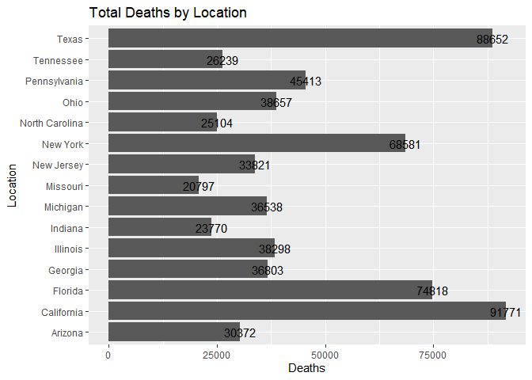
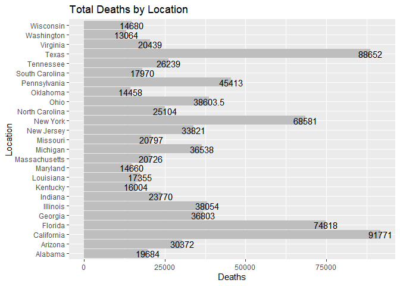
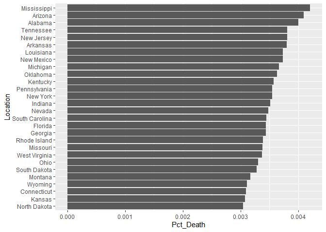
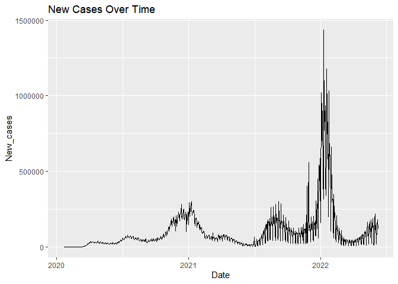
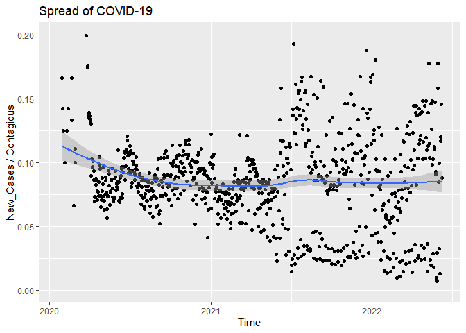
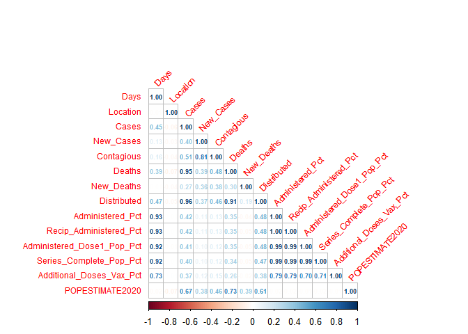
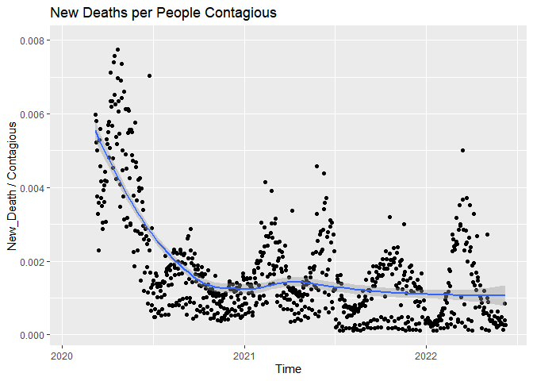
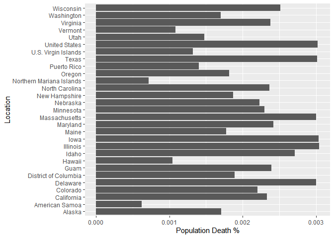

# Introduction

The purpose of this project is to produce a model that will be able to predict the amount of people who contract COVID-19 in the United States as well as predict the amount of deaths that it causes.

## What is COVID-19?

Coronavirus disease 2019 (COVID-19) is a contagious disease caused by a virus, the severe acute respiratory syndrome coronavirus 2 (SARS-CoV-2). The first known case was identified in Wuhan, China, in December 2019. The disease spread worldwide, leading to the COVID-19 pandemic.

Symptoms of COVID‑19 are variable and may imclude fever, cough, headache, fatigue, breathing difficulties, loss of smell, and loss of taste, pneumonia, dyspnea, hypoxia, respiratory failure, shock, multiorgan dysfunction, and death.

COVID-19 transmits when people breathe in air contaminated by droplets and small airborne particles containing the virus. On average, people are contagious two days before the first sign of symptoms and ten days after the first sign of symptoms. 

In mid-December of 2020, the first vaccines were made available to a limited amount of the public. The vaccines were released in a specific order to subsets of the populace. First starting with people over the age of 65 or with health conditions, then to people over the age of 18, before moving to people above the age of 12, and just recently to children age 5 and older.

## Why might this model be useful.

By comparing trends across individual states and the nation as a whole, it is possible that we could find commonalities between states with higher than average cases and deaths. In addition this could also help us identify which of the factors are most significant to the model and therefore, the pandemic. It could also reveal in what ways certain states fail in the implementation of vaccinations. Finally, it could reveal which age subset of the population has the most influence on the spread of the virus.

## Data and Packages

This project uses a combination of two data sets. Both data sets record the historical data of the states and territories of the United States. 

The first set of data is from the [nytimes/covid-19-data]("https://github.com/nytimes/covid-19-data"), which is an ongoing repository of data on coronavirus cases and deaths in the U.S. 

The second set of data is from the 
[COVID-19 Vaccinations in the United States, Jurisdiction](https://data.cdc.gov/Vaccinations/COVID-19-Vaccinations-in-the-United-States-Jurisdi/unsk-b7fc), which covers overall US COVID-19 vaccine deliveries and administration data at national and jurisdiction level.

Here are a few examples of the many variables contained within the combined data set:

  - `Date` : Date data are reported on CDC COVID Data Tracker
  - `Location` : Jurisdiction (State/Territory/Federal Entity)
  - `Cases` : The cumulative amount of cases recorded in the specified state
  - `Deaths` : The cumulative amount of deaths recorded in the specified state
  
Note: The complete codebook can be found in Appendix I
  


# Data Cleaning and Modifications

Most of the data cleaning was done in excel due to the data sets being too large to properly manage and clean within RStudio. 

While neither data set had any major issues, they were arranged by their most recent observations. 

To make them more comprehensible, I sorted them the following ways:

  1.) Ascending Ordered the `Location` alphabetically
  2.) Ascending ordered the `Date` by least recent to most recent
  
I then removed any columns that I did not believe I would need. This included 1 column from the first set of data and 58 columns from the second set of data. 

I then created a column called `Days Since 1st Case` to denote the time that had passed since the first reported case of the coronavirus in the US.

In order to merge both data sets, I had to make sure that both started and ended on the same date for each location. For some locations, there are a month or two of more observations since they have the earliest cases. I then had to add the value of 0 to 43 of the columns for each observation that took place before the distribution of the vaccine. After making sure that the only values in `location` were the 50 states, 5 territories, D.C., and the United States as a whole, I finally merged both sets of data together.

After that, I decided to create 3 more new variables. To see the differences in deaths and cases between individual days, I created `New_Cases` and `New_Deaths`. While it was useful to have the cumulative historic data for `Cases` and `Deaths`, it only reveals the total amount of people who have contracted the virus or died from it. Additionally, because people are contagious an average of 12 days as stated above in "What is COVID-19?", I believed that it would be sensible to have a new variable, `Contagious`, be the sum of the current day's and previous 11 days' observations of `New_Cases`.


```r
# The first 1000 observations from the data set
Data
```

```
## # A tibble: 47,024 × 20
##    Date                 Days Location Cases New_Cases Contagious Deaths
##    <dttm>              <dbl> <fct>    <dbl>     <dbl>      <dbl>  <dbl>
##  1 2020-03-13 00:00:00    52 Alabama      6         6          6      0
##  2 2020-03-14 00:00:00    53 Alabama     12         6         12      0
##  3 2020-03-15 00:00:00    54 Alabama     23        11         23      0
##  4 2020-03-16 00:00:00    55 Alabama     29         6         29      0
##  5 2020-03-17 00:00:00    56 Alabama     39        10         39      0
##  6 2020-03-18 00:00:00    57 Alabama     51        12         51      0
##  7 2020-03-19 00:00:00    58 Alabama     78        27         78      0
##  8 2020-03-20 00:00:00    59 Alabama    106        28        106      0
##  9 2020-03-21 00:00:00    60 Alabama    131        25        131      0
## 10 2020-03-22 00:00:00    61 Alabama    157        26        157      0
## # … with 47,014 more rows, and 13 more variables: New_Deaths <dbl>,
## #   Distributed <dbl>, Administered <dbl>, Administered_Pct <dbl>,
## #   Recip_Administered <dbl>, Recip_Administered_Pct <dbl>,
## #   Administered_Dose1_Recip <dbl>, Administered_Dose1_Pop_Pct <dbl>,
## #   Series_Complete_Yes <dbl>, Series_Complete_Pop_Pct <dbl>,
## #   Additional_Doses <dbl>, Additional_Doses_Vax_Pct <dbl>,
## #   POPESTIMATE2020 <dbl>
```
## Data Grouping

The observations for the United States are a sum of all other observations of the same date. For this reason I will be separating the data into two group. US will have the data for the United States while Jurisdictions will have the remaining data. This will be useful to determine if the prediction models of both groups are alike, seeing as they technically contain the exact same data. We will see if there are differences in the variables being adjusted for each location in Jurisdiction and for the nation as a whole in US.

```r
US <- subset(Data, Location == "United States")
US
```

```
## # A tibble: 871 × 20
##    Date                 Days Location      Cases New_Cases Contagious Deaths
##    <dttm>              <dbl> <fct>         <dbl>     <dbl>      <dbl>  <dbl>
##  1 2020-01-21 00:00:00     0 United States     1         1          1      0
##  2 2020-01-22 00:00:00     1 United States     1         0          1      0
##  3 2020-01-23 00:00:00     2 United States     1         0          1      0
##  4 2020-01-24 00:00:00     3 United States     2         1          2      0
##  5 2020-01-25 00:00:00     4 United States     3         1          3      0
##  6 2020-01-26 00:00:00     5 United States     5         2          5      0
##  7 2020-01-27 00:00:00     6 United States     5         0          5      0
##  8 2020-01-28 00:00:00     7 United States     5         0          5      0
##  9 2020-01-29 00:00:00     8 United States     5         0          5      0
## 10 2020-01-30 00:00:00     9 United States     6         1          6      0
## # … with 861 more rows, and 13 more variables: New_Deaths <dbl>,
## #   Distributed <dbl>, Administered <dbl>, Administered_Pct <dbl>,
## #   Recip_Administered <dbl>, Recip_Administered_Pct <dbl>,
## #   Administered_Dose1_Recip <dbl>, Administered_Dose1_Pop_Pct <dbl>,
## #   Series_Complete_Yes <dbl>, Series_Complete_Pop_Pct <dbl>,
## #   Additional_Doses <dbl>, Additional_Doses_Vax_Pct <dbl>,
## #   POPESTIMATE2020 <dbl>
```

```r
US$Location <- as.factor(US$Location)

States <- subset(Data, Location != "United States")
States
```

```
## # A tibble: 46,153 × 20
##    Date                 Days Location Cases New_Cases Contagious Deaths
##    <dttm>              <dbl> <fct>    <dbl>     <dbl>      <dbl>  <dbl>
##  1 2020-03-13 00:00:00    52 Alabama      6         6          6      0
##  2 2020-03-14 00:00:00    53 Alabama     12         6         12      0
##  3 2020-03-15 00:00:00    54 Alabama     23        11         23      0
##  4 2020-03-16 00:00:00    55 Alabama     29         6         29      0
##  5 2020-03-17 00:00:00    56 Alabama     39        10         39      0
##  6 2020-03-18 00:00:00    57 Alabama     51        12         51      0
##  7 2020-03-19 00:00:00    58 Alabama     78        27         78      0
##  8 2020-03-20 00:00:00    59 Alabama    106        28        106      0
##  9 2020-03-21 00:00:00    60 Alabama    131        25        131      0
## 10 2020-03-22 00:00:00    61 Alabama    157        26        157      0
## # … with 46,143 more rows, and 13 more variables: New_Deaths <dbl>,
## #   Distributed <dbl>, Administered <dbl>, Administered_Pct <dbl>,
## #   Recip_Administered <dbl>, Recip_Administered_Pct <dbl>,
## #   Administered_Dose1_Recip <dbl>, Administered_Dose1_Pop_Pct <dbl>,
## #   Series_Complete_Yes <dbl>, Series_Complete_Pop_Pct <dbl>,
## #   Additional_Doses <dbl>, Additional_Doses_Vax_Pct <dbl>,
## #   POPESTIMATE2020 <dbl>
```

```r
States$Location <- as.factor(States$Location)
```

# Exploratory Data Analysis

```r
Current = subset(States, Days == 870)[c("Location", "Deaths")]
Current
```

```
## # A tibble: 56 × 2
##    Location             Deaths
##    <fct>                 <dbl>
##  1 Alabama               19684
##  2 Alaska                 1246
##  3 American Samoa           31
##  4 Arizona               30372
##  5 Arkansas              11512
##  6 California            91771
##  7 Colorado              12805
##  8 Connecticut           10999
##  9 Delaware               2962
## 10 District of Columbia   1348
## # … with 46 more rows
```

```r
Current <- arrange(Current, desc(Deaths))

head(Current, 15) %>% 
  ggplot(aes(Location, Deaths)) + geom_col() + coord_flip() + labs(title  = "Total Deaths by Location", x = "Location", y = "Deaths") + geom_text(aes(label = round(Deaths, 1)))
```

<!-- -->

```r
Toll = subset(US, New_Cases >= 0)[c("Date", "New_Cases")]

ggplot(Toll, aes(Date, New_Cases)) + geom_line() + labs(title  = "New Cases Over Time", x = "Date", y = "New_cases")
```

<!-- -->

```r
Fatalities = subset(US, New_Deaths >= 0)[c("Date", "New_Deaths")]

ggplot(Fatalities, aes(Date, New_Deaths)) + geom_line() + labs(title  = "Frequency of Lives Lost", x = "Date", y = "New_Deaths")
```

<!-- -->

```r
Spread = subset(US, New_Cases >= 0)[c("Contagious", "New_Cases")]

ggplot(Spread, aes(Contagious, New_Cases), scale="exponential") + geom_point() + labs(title  = "Spread of COVID-19", x = "Contagious", y = "New_Cases")
```

<!-- -->

```r
States$Location <- as.numeric(States$Location)

US %>%
  select(Days, Cases, New_Cases, Contagious, Deaths, New_Deaths, Distributed, Administered_Pct, Recip_Administered_Pct,	Administered_Dose1_Pop_Pct, Series_Complete_Pop_Pct, Additional_Doses_Vax_Pct,	POPESTIMATE2020) %>% 
  cor() %>% 
  corrplot(type = 'lower', diag = TRUE, method = 'number', tl.srt = 45, tl.offset = 0.5, tl.cex = 0.75, number.cex= 0.57) 
```

<!-- -->

```r
States %>%
  select(Days, Location, Cases, New_Cases, Contagious, Deaths, New_Deaths, Distributed, Administered_Pct, Recip_Administered_Pct,	Administered_Dose1_Pop_Pct, Series_Complete_Pop_Pct, Additional_Doses_Vax_Pct,	POPESTIMATE2020) %>% 
  cor() %>% 
  corrplot(type = 'lower', diag = TRUE, method = 'number', tl.srt = 45, tl.offset = 0.5, tl.cex = 0.75, number.cex= 0.57)
```

<!-- -->
The results for the States correlation variables and for the US correlation variables reveals that there are major differences between what is revealed by each correlation plot. As can be seen within the lower right triangle in the US plot, almost all variables that are associated with vaccinations have high to extremely high correlations. When comparing those same correlation factors in the States plot, it is clear to see that the summation of all `Location` variables in the US data set skews the initial results of the State data set. This can be evidenced by the fact that there are 14 correlation factors in the US plot that are 0.99 or above. This would mean each variable of those correlation factors would increase and decrease at nearly the exact same rate. I find it very hard to believe that `Dist_Per_100K` and `Admin_Per_100K` would have the same rate of change because that would imply that almost no vaccines that are distributed around the country ever expire or go to waste. I also know for a fact that there were many administration centers that were offering the vaccine to people below the age of 65 at the time when those vaccines were reserved for them since they are considered the most vulnerable. The centers were being given more vaccines than they had people they were meant to administer them to. And the trouble with expired vaccines is that unlike food past its expiration date, vaccines past their expiration date may still leave people vulnerable to the virus.

In addition, the other part of the plots reveal that correlation factors involved with cases and deaths have stronger significance in the States data set. The correlation factors in the US variables make it look like the distribution and administration of the vaccine had very little effect on the amount of people who got infected and the amount who died. Since that would imply that taking a vaccine does not noticeably decreases your chancres of catching the virus, it would go against the scientific fact that vaccines are directly responsible for the prevention of viruses and diseases spreading.


```r
set <- subset(Data, Days == 870)

Set <- set %>%
   group_by(Location) %>%
   summarise(Pct_Death = Deaths / POPESTIMATE2020)

Set1 <- Set[order(-Set$Pct_Death),]

Set1a <- Set1[0:28,]
Set1b <- Set1[29:57,]

Set1a
```

```
## # A tibble: 28 × 2
##    Location      Pct_Death
##    <fct>             <dbl>
##  1 Mississippi     0.00421
##  2 Arizona         0.00409
##  3 Alabama         0.00400
##  4 West Virginia   0.00392
##  5 Tennessee       0.00381
##  6 New Jersey      0.00381
##  7 Arkansas        0.00380
##  8 Louisiana       0.00374
##  9 New Mexico      0.00374
## 10 Michigan        0.00367
## # … with 18 more rows
```

```r
plot1 <- ggplot(Set1a, aes(x = Pct_Death, y = Location)) + geom_col() + xlab("Population Death %") + ylab("Location")
plot1
```

<!-- -->

```r
plot2 <- ggplot(Set1b, aes(x = Pct_Death, y = Location)) + geom_col() + xlab("Population Death %") + ylab("Location")
plot2
```

<!-- -->

# Model Building

The goal in this project will be to build a model from the States data set that most accurately predicts its own `Deaths` or `New_Deaths` and those of the US data set. Then, we will do the opposite and compare the results of both to see whether `States` or `US` more accurately predict both data sets.

## Data Splitting


```r
set.seed(91362)

States0_split <- initial_split(States, prop = 0.7, strata = Location)
States0_train <- training(States0_split)
States0_test <- testing(States0_split)

US1_split <- initial_split(US, prop = 0.7, strata = Deaths)
US1_train <- training(US1_split)
US1_test <- testing(US1_split)

US2_split <- initial_split(US, prop = 0.7, strata = New_Deaths)
US2_train <- training(US2_split)
US2_test <- testing(US2_split)

States1_split <- initial_split(States, prop = 0.7, strata = Deaths)
States1_train <- training(States1_split)
States1_test <- testing(States1_split)

States2_split <- initial_split(States, prop = 0.7, strata = New_Deaths)
States2_train <- training(States2_split)
States2_test <- testing(States2_split)
```

```r
set.seed(345)

States0_folds <- vfold_cv(States0_train, strata = Location, v = 5)
US1_folds <- vfold_cv(US1_train, strata = Deaths, v = 5)
US2_folds <- vfold_cv(US2_train, strata = New_Deaths, v = 5)
States1_folds <- vfold_cv(States1_train, strata = Deaths, v = 5)
States2_folds <- vfold_cv(States2_train, strata = New_Deaths, v = 5)
```


```r
States0_train_recipe <- recipe(Location ~ Days + Cases + New_Cases + Deaths + New_Deaths + Contagious + Distributed + Administered +	Recip_Administered + Administered_Dose1_Recip + Series_Complete_Yes + Additional_Doses, data = States0_train)

US1_train_recipe <- recipe(Deaths ~ Days + Cases + New_Cases + Contagious +  Distributed + Administered + Administered_Pct +	Recip_Administered + Recip_Administered_Pct + Administered_Dose1_Recip + Administered_Dose1_Pop_Pct + Series_Complete_Yes + Series_Complete_Pop_Pct + Additional_Doses + Additional_Doses_Vax_Pct + POPESTIMATE2020, data = US1_train)

US2_train_recipe <- recipe(New_Deaths ~ Days + Cases + New_Cases + Contagious +  Distributed + Administered + Administered_Pct +	Recip_Administered + Recip_Administered_Pct + Administered_Dose1_Recip + Administered_Dose1_Pop_Pct + Series_Complete_Yes + Series_Complete_Pop_Pct + Additional_Doses + Additional_Doses_Vax_Pct + POPESTIMATE2020, data = US2_train)

States1_train_recipe <- recipe(Deaths ~ Days + Cases + New_Cases + Contagious +  Distributed + Administered + Administered_Pct +	Recip_Administered + Recip_Administered_Pct + Administered_Dose1_Recip + Administered_Dose1_Pop_Pct + Series_Complete_Yes + Series_Complete_Pop_Pct + Additional_Doses + Additional_Doses_Vax_Pct + POPESTIMATE2020, data = States1_train)

States2_train_recipe <- recipe(New_Deaths ~ Days + Cases + New_Cases + Contagious +  Distributed + Administered + Administered_Pct +	Recip_Administered + Recip_Administered_Pct + Administered_Dose1_Recip + Administered_Dose1_Pop_Pct + Series_Complete_Yes + Series_Complete_Pop_Pct + Additional_Doses + Additional_Doses_Vax_Pct + POPESTIMATE2020, data = States2_train)
```

```r
States0_train$Location <- as.factor(States0_train$Location)
log_reg <- logistic_reg() %>% 
  set_engine("glm") %>% 
  set_mode("classification")

log_wkflow <- workflow() %>% 
  add_model(log_reg) %>% 
  add_recipe(States0_train_recipe)

log_fit <- fit(log_wkflow, States0_train)
log_fit
```

```
## ══ Workflow [trained] ══════════════════════════════════════════════════════════
## Preprocessor: Recipe
## Model: logistic_reg()
## 
## ── Preprocessor ────────────────────────────────────────────────────────────────
## 0 Recipe Steps
## 
## ── Model ───────────────────────────────────────────────────────────────────────
## 
## Call:  stats::glm(formula = ..y ~ ., family = stats::binomial, data = data)
## 
## Coefficients:
##              (Intercept)                      Days                     Cases  
##                3.662e+00                 2.307e-03                -4.371e-06  
##                New_Cases                    Deaths                New_Deaths  
##               -4.608e-06                 6.175e-05                 5.969e-04  
##               Contagious               Distributed              Administered  
##                1.158e-05                -5.547e-06                 3.084e-05  
##       Recip_Administered  Administered_Dose1_Recip       Series_Complete_Yes  
##               -7.416e-06                -1.498e-05                -1.565e-05  
##         Additional_Doses  
##               -1.250e-05  
## 
## Degrees of Freedom: 32304 Total (i.e. Null);  32292 Residual
## Null Deviance:	    5789 
## Residual Deviance: 3488 	AIC: 3514
```

```r
lda_mod <- discrim_linear() %>% 
  set_mode("classification") %>% 
  set_engine("MASS")

lda_wkflow <- workflow() %>% 
  add_model(lda_mod) %>% 
  add_recipe(States0_train_recipe)

lda_fit <- fit(lda_wkflow, States0_train)
lda_fit
```

```
## ══ Workflow [trained] ══════════════════════════════════════════════════════════
## Preprocessor: Recipe
## Model: discrim_linear()
## 
## ── Preprocessor ────────────────────────────────────────────────────────────────
## 0 Recipe Steps
## 
## ── Model ───────────────────────────────────────────────────────────────────────
## Call:
## lda(..y ~ ., data = data)
## 
## Prior probabilities of groups:
##          1          2          3          4          5          6          7 
## 0.01786101 0.01705618 0.01204148 0.01934685 0.01767528 0.01903730 0.01724191 
##          8          9         10         11         12         13         14 
## 0.01783006 0.01779910 0.01764433 0.01817056 0.01810865 0.01752051 0.01783006 
##         15         16         17         18         19         20         21 
## 0.01823247 0.01906826 0.01783006 0.01792292 0.01838725 0.01745860 0.01854202 
##         22         23         24         25         26         27         28 
## 0.01832534 0.01736573 0.01891348 0.01748955 0.01801579 0.01798483 0.01764433 
##         29         30         31         32         33         34         35 
## 0.01665377 0.01866584 0.01736573 0.01770624 0.01820152 0.01783006 0.01810865 
##         36         37         38         39         40         41         42 
## 0.01823247 0.01807770 0.01724191 0.01820152 0.01776815 0.01786101 0.01786101 
##         43         44         45         46         47         48         49 
## 0.01739669 0.01792292 0.01835629 0.01804674 0.01832534 0.01857298 0.01758242 
##         51         52         53         54         55         56         57 
## 0.01789197 0.01798483 0.01748955 0.01875871 0.01718000 0.01900635 0.01736573 
## 
## Group means:
##        Days        Cases   New_Cases       Deaths   New_Deaths  Contagious
## 1  455.0572  549590.2374  1664.25650  9374.190641  23.27729636  19800.7071
## 2  471.5463   91475.1670   328.33031   456.704174   1.79673321   3751.9383
## 3  610.2082     881.8715    12.15938     2.971722   0.05912596    145.6684
## 4  429.8112  793478.1984  2376.13440 13749.332800  34.41440000  28094.5776
## 5  451.3730  344531.4641   952.00701  5184.155867  14.39754816  11537.5639
## 6  439.1821 3596965.2683 11830.88293 45678.304065 103.71219512 139496.3122
## 7  451.9946  530437.0251  1724.54039  6045.876122  15.73788151  20436.1185
## 8  450.9514  308195.4844   898.48264  6891.338542  13.23263889  11359.4097
## 9  452.2539  103923.3113   329.18957  1450.803478   3.45913043   3968.9287
## 10 468.5526   55577.5035   193.12807   934.512281   1.62456140   2352.2579
## 11 461.0051 2475108.5877  7471.00852 35748.889267  86.88074957  88928.6388
## 12 438.4769 1004132.7966  2934.03761 16819.639316  44.58461538  34388.0410
## 13 465.1237   14879.9859    64.13074   153.353357   0.46289753    754.3799
## 14 467.2552   69269.5399   326.90799   575.413194   1.89756944   3833.2257
## 15 456.5195  189203.6486   562.81324  2133.016978   6.05432937   6631.4024
## 16 433.6737 1241020.9367  3355.99188 19920.920455  43.06818182  44997.7159
## 17 461.4253  731113.8194  2205.10069 11850.630208  28.64409722  25809.4427
## 18 457.4197  347639.9810   878.87047  4878.328152  11.69775475  10995.8756
## 19 463.9411  329296.5067  1029.95960  4237.321549  10.84511785  11781.7172
## 20 458.0514  501908.6773  1729.09397  6385.544326  18.50886525  20522.9238
## 21 458.9466  524425.6728  1499.10851  9800.290484  21.06010017  17835.3255
## 22 464.3142   79574.3970   313.23311   865.125000   2.76858108   3888.6284
## 23 452.6524  433229.4153  1277.35472  7864.770053  16.84848485  16213.8093
## 24 445.9116  669992.6956  2149.62848 14138.255319  21.71194763  25860.6481
## 25 466.0283  970422.6991  3649.30265 18296.424779  48.22300885  38275.6372
## 26 459.5430  587421.5515  1691.78694  6470.912371  15.41237113  21249.8866
## 27 460.6093  343053.0757   961.87435  6562.624785  14.22030981  11682.2530
## 
## ...
## and 203 more lines.
```

```r
log_acc <- predict(log_fit, new_data = States0_train, type = "class") %>% 
  bind_cols(States0_train %>% select(Location)) %>% 
  accuracy(truth = Location, estimate = .pred_class)
lda_acc <- predict(lda_fit, new_data = States0_train, type = "class") %>% 
  bind_cols(States0_train %>% select(Location)) %>% 
  accuracy(truth = Location, estimate = .pred_class)

results <- bind_rows(log_acc, lda_acc) %>% 
  tibble() %>% mutate(model = c("Logistic", "LDA")) %>% 
  select(model, .estimate) %>% 
  arrange(.estimate)

results
```

```
## # A tibble: 2 × 2
##   model    .estimate
##   <chr>        <dbl>
## 1 Logistic    0.0241
## 2 LDA         0.393
```
Considering that there are 47,025 observations in the data set as well as 57 possible locations that are being predicted, an accuracy rate of nearly 29% is not too terrible. Nonetheless, the model.

```r
tree_spec <- decision_tree() %>%
  set_engine("rpart")

class_tree_spec <- tree_spec %>%
  set_mode("classification")

class_tree_wf <- workflow() %>%
  add_model(class_tree_spec %>% set_args(cost_complexity = tune())) %>%
  add_recipe(States0_train_recipe)

param_grid <-grid_regular(cost_complexity(range = c(-3, -1)), levels = 10)

tune_res <- tune_grid(
  class_tree_wf, 
  resamples = States0_folds, 
  grid = param_grid, 
  metrics = metric_set(roc_auc),
  control = control_grid(verbose = TRUE)
  )

tune.res <- autoplot(tune_res)
tune.res
```

```r
complexity <- arrange(collect_metrics(tune_res), desc(mean))
best_complexity <- complexity[1,]
best_complexity

class_tree_final <- finalize_workflow(class_tree_wf, best_complexity)

class_tree_final_fit <- fit(class_tree_final, data = States0_train)

fit <- rpart(Location ~ States0_train_recipe, class_tree_final)

fit1 <- prune(fit, cp = 0.001)
plot()
```

```r
rec_poly <- States2_train_recipe %>%
  step_poly(Days, degree = 4)

lm_spec <- linear_reg() %>%
  set_mode("regression") %>%
  set_engine("lm")

poly_wf <- workflow() %>%
  add_model(lm_spec) %>%
  add_recipe(rec_poly)

poly_fit <- fit(poly_wf, data = US)
tidy(poly_fit)
```

```
## # A tibble: 20 × 5
##    term                       estimate     std.error statistic   p.value
##    <chr>                         <dbl>         <dbl>     <dbl>     <dbl>
##  1 (Intercept)                -2.67e+2  357.            -0.747  4.55e- 1
##  2 Cases                       1.18e-4    0.00000920    12.9    8.65e-35
##  3 New_Cases                   3.95e-3    0.000328      12.0    5.69e-31
##  4 Contagious                 -1.09e-4    0.0000331     -3.30   1.02e- 3
##  5 Distributed                 2.44e-5    0.00000400     6.09   1.67e- 9
##  6 Administered               -2.18e-5    0.00000815    -2.67   7.65e- 3
##  7 Administered_Pct           NA         NA             NA     NA       
##  8 Recip_Administered          3.79e-5    0.0000128      2.96   3.13e- 3
##  9 Recip_Administered_Pct     NA         NA             NA     NA       
## 10 Administered_Dose1_Recip   -8.52e-5    0.0000147     -5.78   1.02e- 8
## 11 Administered_Dose1_Pop_Pct NA         NA             NA     NA       
## 12 Series_Complete_Yes        -1.63e-5    0.00000717    -2.27   2.32e- 2
## 13 Series_Complete_Pop_Pct    NA         NA             NA     NA       
## 14 Additional_Doses           -8.52e-5    0.0000103     -8.31   3.69e-16
## 15 Additional_Doses_Vax_Pct   NA         NA             NA     NA       
## 16 POPESTIMATE2020            NA         NA             NA     NA       
## 17 Days_poly_1                -1.46e+4 9855.            -1.48   1.39e- 1
## 18 Days_poly_2                -2.67e+3 3738.            -0.713  4.76e- 1
## 19 Days_poly_3                -1.12e+4 1485.            -7.53   1.30e-13
## 20 Days_poly_4                -1.60e+4  999.           -16.0    1.23e-50
```
While almost none of the p-values indicate any significance, this does tell me that the predictor variables that have `NA` for everything are not of any use within my recipe. It also reveals that `Cases` has no significance at all. Thus, I will now change all of my regression recipes to account for this.

```r
US1_train_recipe <- recipe(Deaths ~ Days + New_Cases + Contagious +  Distributed + Administered +	Recip_Administered + Administered_Dose1_Recip + Series_Complete_Yes + Additional_Doses, data = US1_train)

US2_train_recipe <- recipe(New_Deaths ~ Days + New_Cases + Contagious +  Distributed + Administered +	Recip_Administered + Administered_Dose1_Recip + Series_Complete_Yes + Additional_Doses, data = US2_train)

States1_train_recipe <- recipe(Deaths ~ Days + New_Cases + Contagious +  Distributed + Administered +	Recip_Administered + Administered_Dose1_Recip + Series_Complete_Yes + Additional_Doses, data = States1_train)

States2_train_recipe <- recipe(New_Deaths ~ Days + New_Cases + Contagious +  Distributed + Administered +	Recip_Administered + Administered_Dose1_Recip + Series_Complete_Yes + Additional_Doses, data = States1_train)
```
Now that I have readjusted my recipes, let's see if they have a significant change on the previous results.


