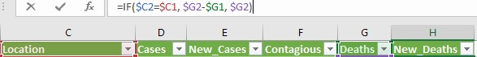
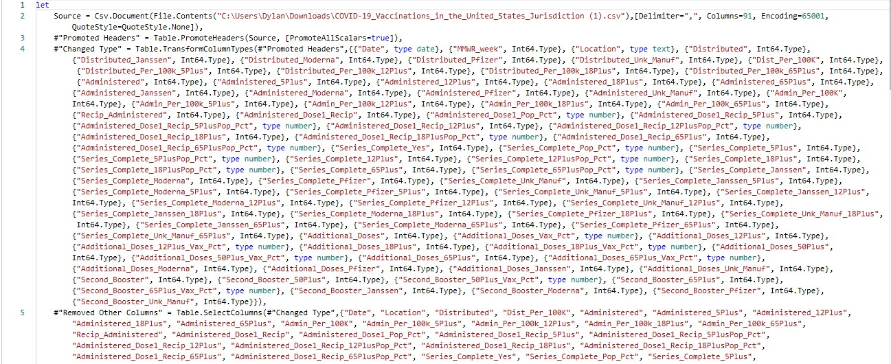
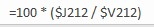
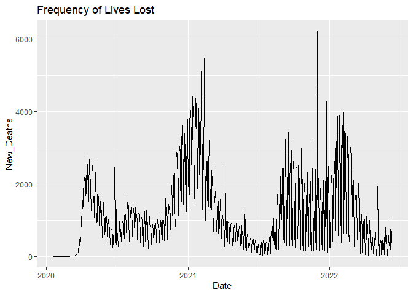
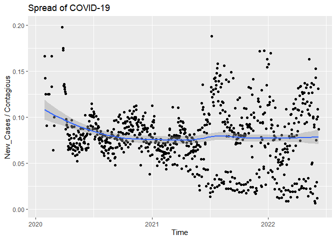

# Introduction

The purpose of this project is to produce a model that will be able to predict the amount of people who contract COVID-19 in the United States as well as predict the amount of deaths that it causes.

## What is COVID-19?

Coronavirus disease 2019 (COVID-19) is a contagious disease caused by a virus, the severe acute respiratory syndrome coronavirus 2 (SARS-CoV-2). The first known case was identified in Wuhan, China, in December 2019. The disease spread worldwide, leading to the COVID-19 pandemic.

Symptoms of COVID‑19 are variable and may imclude fever, cough, headache, fatigue, breathing difficulties, loss of smell, and loss of taste, pneumonia, dyspnea, hypoxia, respiratory failure, shock, multiorgan dysfunction, and death.

COVID-19 transmits when people breathe in air contaminated by droplets and small airborne particles containing the virus. On average, people are contagious two days before the first sign of symptoms and ten days after the first sign of symptoms. 

In mid-December of 2020, the first vaccines were made available to a limited amount of the public. The vaccines were released in a specific order to subsets of the populace. First starting with people over the age of 65 or with health conditions, then to people over the age of 18, before moving to people above the age of 12, and just recently to children age 5 and older.

## Why might this model be useful.

By comparing trends across individual states and the nation as a whole, it is possible that we could find commonalities between states with higher than average cases and deaths. In addition this could also help us identify which of the factors are most significant to the model and therefore, the pandemic. In addition, it would be useful to be able to determine the origins of each observation without knowing the location beforehand.

## Packages

The following packages will be used in a variety of methods to learn more about the data and construct the most accurate model possible.

```r
# Load packages
library(corrplot)
library(corrr)
library(discrim)
library(dplyr)
library(forcats)
library(ggplot2)
library(gridExtra)
library(ISLR)
library(ISLR2)
library(janitor)
library(klaR)
library(randomForest)
library(readr)
library(readxl)
library(rpart.plot)
library(tidymodels)
library(tidyverse)
library(tune)
library(vip)
library(xgboost)
```

## Data Sets 
  
This project uses a combination of four data sets containing a multitude of relevant variables the will be used as the predictors in the model that will be created.
  
The first two data sets record the historical data for COVID-19 of each state and territory within the United States while the last two data sets are estimations of each state and territory population from 2020. 

The first set of data was found at the New York Times ongoing repository of data on COVID-19 cases and deaths in the United States.
The second set of data was found at the CDC (Center for Disease Control and Prevention), and covers the overall US COVID-19 vaccine distribution and administration data at a national and jurisdiction level. Finally, the third and fourth sets of data are from the United States Census Bureau, the nation’s leading provider of quality data about its people and economy.

All of the data sets can be found in the following links:
  - [nytimes/covid-19-data]("https://github.com/nytimes/covid-19-data")
  - [COVID-19 Vaccinations in the United States, Jurisdiction]("https://data.cdc.gov/Vaccinations/COVID-19-Vaccinations-in-the-United-States-Jurisdi/unsk-b7fc")
  - [2020 Population of U.S. Island Areas]("https://www.census.gov/library/stories/2021/10/first-2020-census-united-states-island-areas-data-released-today.html#:~:text=The%20combined%20population%20of%20the%20territories%20of%20American,are%20located%20in%20the%20Pacific%20and%20the%20Caribbean.?adlt=strict&toWww=1&redig=E754666D7D8F4F3287C3F2684EE5A8D1")
  - [Resident Population for the 50 states, the District of Columbia, and Puerto Rico: 2020 Census]("https://www2.census.gov/programs-surveys/decennial/2020/data/apportionment/apportionment-2020-table02.pdf#:~:text=RESIDENT%20POPULATION%20%28APRIL%201%2C%202020%29%20Alabama,5%2C024%2C279%20Alaska%20733%2C391%20Arizona%207%2C151%2C502%20Arkansas%203%2C011%2C524?adlt=strict&toWww=1&redig=2BA221E2379945519A6B89E8DA5C31BA")

  Here are a few examples of the many variables contained within the final combined data set:
  - `Date` : Date that data is reported on the CDC COVID Data Tracker
  - `Location` : Jurisdiction (State/Territory/Federal Entity) that data is taken from
  - `Cases` : The cumulative amount of cases recorded
  - `Deaths` : The cumulative amount of deaths recorded
Note: The complete codebook can be found in Appendix I

## Data Cleaning and Modifications

Most of the data cleaning was done within Microsoft Excel due to the relative ease that it allows users to modify data. 

Beginning with the first data set, I modified it to only contain the necessary variables that will be needed and organized it in ascending order based on `Location` first and `Date` second. I also decided to add a few new variables to the data set.
  
{width="5000"}
I then created the variables, `Days`, `New_Cases`, `Contagious`, and `New_Deaths`.
  
{width="200"}

{width="1500"}

{width="1500"}

While the other new variables are self explanatory, `Contagious` will be created to account for the amount of people that are capable of spreading the virus at any one time based on a 12 day average period that people can transmit the virus to others.
{width="1500"}

Moving on to the second set of data, I got rid of over 50 variables and sorted the data the same way as the first data set.
{width="1500"}
I also had to change all of the values in `Location` to their full names instead of their abbreviations.
{width="1500"}
{width="1500"}
I finally merged the two data sets into one.

{width="1500"}
Seeing that I did not need so many variables, so I got rid of the ones that I felt were not necessary.
{width="1500"}
The final step was to merge this with the combined third and fourth data set.
{width="800"}
Then, I realized that every variable that was a percentage was rounded to the nearest percent, so I recalculated every percentage to three decimal places with the following code: 
{width="175"}


```r
# Here is a look at the data set
Data
```

```
## # A tibble: 47,024 × 18
##    Date                 Days Location Cases New_Cases Contagious Deaths
##    <dttm>              <dbl> <chr>    <dbl>     <dbl>      <dbl>  <dbl>
##  1 2020-03-13 00:00:00    52 Alabama      6         6          6      0
##  2 2020-03-14 00:00:00    53 Alabama     12         6         12      0
##  3 2020-03-15 00:00:00    54 Alabama     23        11         23      0
##  4 2020-03-16 00:00:00    55 Alabama     29         6         29      0
##  5 2020-03-17 00:00:00    56 Alabama     39        10         39      0
##  6 2020-03-18 00:00:00    57 Alabama     51        12         51      0
##  7 2020-03-19 00:00:00    58 Alabama     78        27         78      0
##  8 2020-03-20 00:00:00    59 Alabama    106        28        106      0
##  9 2020-03-21 00:00:00    60 Alabama    131        25        131      0
## 10 2020-03-22 00:00:00    61 Alabama    157        26        157      0
## # … with 47,014 more rows, and 11 more variables: New_Deaths <dbl>,
## #   Distributed <dbl>, Administered <dbl>, Recip_Administered <dbl>,
## #   Administered_Dose1_Recip <dbl>, Administered_Dose1_Pop_Pct <dbl>,
## #   Series_Complete_Yes <dbl>, Series_Complete_Pop_Pct <dbl>,
## #   Additional_Doses <dbl>, Additional_Doses_Vax_Pct <dbl>,
## #   POPESTIMATE2020 <dbl>
```
I happened to notice that there were some occasional mistakes in the reported observations which would cause some of the variables to produce negative values. To fix this, I will delete all rows that contain at least one negative value. At the same time, I will keep a copy of the original data set to use for the values that are in the deleted rows but do not have negative values.

```r
Data1 <- subset(Data, New_Cases >= 0)
Data1 <- subset(Data1, Contagious >= 0)
Data1 <- subset(Data1, New_Deaths >= 0)
Data1
```

```
## # A tibble: 46,405 × 18
##    Date                 Days Location Cases New_Cases Contagious Deaths
##    <dttm>              <dbl> <chr>    <dbl>     <dbl>      <dbl>  <dbl>
##  1 2020-03-13 00:00:00    52 Alabama      6         6          6      0
##  2 2020-03-14 00:00:00    53 Alabama     12         6         12      0
##  3 2020-03-15 00:00:00    54 Alabama     23        11         23      0
##  4 2020-03-16 00:00:00    55 Alabama     29         6         29      0
##  5 2020-03-17 00:00:00    56 Alabama     39        10         39      0
##  6 2020-03-18 00:00:00    57 Alabama     51        12         51      0
##  7 2020-03-19 00:00:00    58 Alabama     78        27         78      0
##  8 2020-03-20 00:00:00    59 Alabama    106        28        106      0
##  9 2020-03-21 00:00:00    60 Alabama    131        25        131      0
## 10 2020-03-22 00:00:00    61 Alabama    157        26        157      0
## # … with 46,395 more rows, and 11 more variables: New_Deaths <dbl>,
## #   Distributed <dbl>, Administered <dbl>, Recip_Administered <dbl>,
## #   Administered_Dose1_Recip <dbl>, Administered_Dose1_Pop_Pct <dbl>,
## #   Series_Complete_Yes <dbl>, Series_Complete_Pop_Pct <dbl>,
## #   Additional_Doses <dbl>, Additional_Doses_Vax_Pct <dbl>,
## #   POPESTIMATE2020 <dbl>
```
Now I will not have to worry about observational data points that exis outside of the logical range of values for each variable.

## Data Grouping

The observations for the United States are a sum of all other observations of the same date. For this reason I will be separating the data into two group. US will have the data for the United States while Jurisdictions will have the remaining data. This will be useful to determine if the prediction models of both groups are alike, seeing as they technically contain the exact same data. We will see if there are differences in the variables being adjusted for each location in Jurisdiction and for the nation as a whole in US.

```r
# With the negative values
US <- subset(Data, Location == "United States")
# Without the negative values
US1 <- subset(Data1, Location == "United States")

# With the negative values
States <- subset(Data, Location != "United States")
# Without the negative values
States1 <- subset(Data1, Location != "United States")

# Convert Location to a factor 
States1$Location <- as.factor(States1$Location)
States$Location <- as.factor(States$Location)
```

# Exploratory Data Analysis

Now, let's take a look at the data and its trends.
  
## Cumulative Death Toll

```r
unique(Data$Location)
```

```
##  [1] "Alabama"                  "Alaska"                  
##  [3] "American Samoa"           "Arizona"                 
##  [5] "Arkansas"                 "California"              
##  [7] "Colorado"                 "Connecticut"             
##  [9] "Delaware"                 "District of Columbia"    
## [11] "Florida"                  "Georgia"                 
## [13] "Guam"                     "Hawaii"                  
## [15] "Idaho"                    "Illinois"                
## [17] "Indiana"                  "Iowa"                    
## [19] "Kansas"                   "Kentucky"                
## [21] "Louisiana"                "Maine"                   
## [23] "Maryland"                 "Massachusetts"           
## [25] "Michigan"                 "Minnesota"               
## [27] "Mississippi"              "Missouri"                
## [29] "Montana"                  "Nebraska"                
## [31] "Nevada"                   "New Hampshire"           
## [33] "New Jersey"               "New Mexico"              
## [35] "New York"                 "North Carolina"          
## [37] "North Dakota"             "Northern Mariana Islands"
## [39] "Ohio"                     "Oklahoma"                
## [41] "Oregon"                   "Pennsylvania"            
## [43] "Puerto Rico"              "Rhode Island"            
## [45] "South Carolina"           "South Dakota"            
## [47] "Tennessee"                "Texas"                   
## [49] "U.S. Virgin Islands"      "United States"           
## [51] "Utah"                     "Vermont"                 
## [53] "Virginia"                 "Washington"              
## [55] "West Virginia"            "Wisconsin"               
## [57] "Wyoming"
```

```r
Current = subset(States, Days == 870)[c("Location", "Deaths")]
Current <- arrange(Current, desc(Deaths))
Current
```

```
## # A tibble: 56 × 2
##    Location     Deaths
##    <fct>         <dbl>
##  1 California   91771 
##  2 Texas        88652 
##  3 Florida      74818 
##  4 New York     68581 
##  5 Pennsylvania 45413 
##  6 Ohio         38604.
##  7 Illinois     38054 
##  8 Georgia      36803 
##  9 Michigan     36538 
## 10 New Jersey   33821 
## # … with 46 more rows
```

```r
head(Current, 25) %>% 
  ggplot(aes(Location, Deaths)) + geom_col(fill = "grey") + coord_flip() + labs(title  = "Total Deaths by Location", x = "Location", y = "Deaths") + geom_text(aes(label = round(Deaths, 1)))
```

<!-- -->
This death toll highlights how deadly a virus can be in the 21st century with our current world population. If you know which states have the largest populations, you will notice that most of them are featured in the above bar graph. It does not, however, account for the total populations of each state. Therefore, to get a better perspective of which states lost the most people compared to their respective populations, we will look at the percentage of deaths across all states and territories. 

```r
set <- subset(Data, Days == 870)

Set <- set %>%
   group_by(Location) %>%
   summarise(Pct_Death = Deaths / POPESTIMATE2020)

Set1 <- Set[order(-Set$Pct_Death),]

Set1a <- Set1[0:28,]
Set1b <- Set1[29:57,]

Set1a %>% 
  mutate(Location = fct_reorder(Location, Pct_Death)) %>%
  ggplot(aes(x = Location, y = Pct_Death)) + geom_col() + coord_flip()
```

<!-- -->

```r
Set1b %>% 
  mutate(Location = fct_reorder(Location, Pct_Death)) %>%
  ggplot(aes(x = Location, y = Pct_Death)) + geom_col() + coord_flip()
```

<!-- -->
Observing the percent of people who have died in each location, you will notice the sad fact that over half of the locations have a higher than average rate of death compared to the nation as a whole.

## Cases and Deaths

The amount of cases rose exponentially at the start of the pandemic. Once the vaccine was created, it would make more sense that the number of new cases would rise at a smaller rate than before, but that is not what we can see here.


```r
ggplot(US1, aes(Date, New_Cases)) + geom_line() + labs(title  = "New Cases Over Time", x = "Date", y = "New_cases")
```

<!-- -->
It appears that even though the vaccine has been around for more than 1.5 years, the rate of new cases has not become consistently diminished. Instead, it seems like the amount of new cases has a downward trend for the first half of the year before rapidly spiking around the holidays. This would suggest that even with a majority of people being vaccinated, loosening quarantine procedures around the country has been a bad idea. The evidence for this claim can be seen in the amount of new deaths that this has resulted in.

```r
Fatalities = subset(US, New_Deaths >= 0)

ggplot(Fatalities, aes(Date, New_Deaths)) + geom_line() + labs(title  = "Frequency of Lives Lost", x = "Date", y = "New_Deaths")
```

<!-- -->
It should be noticeable how both line plots seem to have similar trends after the implementation of the vaccine became widely available in the beginning of 2021.

## Spread of COVID-19

Next, we will see the historical rates of people that die based on new cases, people who die based on people who are contagious, and people who contact the virus based on people who are contagious. With the observation, we will be able to verify the claims made previously as well as the trends that have been shown.

```r
Spread1 = subset(US, New_Cases >= 0)
Spread1a = subset(Spread1, Contagious >= 0)

ggplot(Spread1a, aes(Date, New_Cases / Contagious)) + geom_point() + labs(title  = "Spread of COVID-19", x = "Time", y = "New_Cases / Contagious") + geom_smooth() + ylim(0.001, 0.2)
```

<!-- -->
The scatter plot seem rather consistent until somewhere around May 2021. At that point in time, the observational points start to widely vary and continues to do so through the present day. This is around the exact same time when the vaccine became available for all people over the age of 18. Up until that point, all states were at the same point in regards to quarantining. Past this point, there was a divide in the nation between people who were accepting of the vaccine and those who refused to get it, those who still mandated masks and those who saw no need for masks, and those who were for or against loosening quarantine restrictions and social distancing. These opinions tended to be centered around entire regions of the country. This among other factors may be the cause for the larger variability past the introduction of the vaccine.


```r
Spread2 = subset(US, New_Deaths >= 0)
Spread2a = subset(Spread2, Contagious >= 0)

ggplot(Spread2a, aes(Date, New_Deaths / Contagious)) + geom_point() + labs(title  = "New Deaths per People Contagious", x = "Time", y = "New_Death / Contagious") + geom_smooth() + ylim(0.0001, 0.008)
```

<!-- -->
Here, we can observe that the spikes in the death rate tend to happen periodically every few months. Despite this, it does not look like the implementation of the vaccine lessened the death rate as much as social distancing and quarantining did. At the same time, the vaccine has managed to keep the rate consistently lower than at the beginning of the pandemic even with social distancing restrictions being largely lifted around the country.


```r
Spread3 = subset(US, New_Cases >= 0)
Spread3a = subset(Spread3, New_Deaths >= 0)

ggplot(Spread3a, aes(Date, New_Deaths / New_Cases)) + geom_point() + labs(title  = "Mortality Rate", x = "Time", y = "New_Deaths / New_Cases") + geom_smooth() + ylim(0.0001, 0.125)
```

<!-- -->
Based on the repeated increases and decreases in the mortality rate, it does not seem to have been affected that much by the implementation of the vaccine. It appears that the mortality rate of those who contract the virus is the same before and after the distribution of the vaccine. This makes some sense because a vaccine is not the same thing as a cure. While a vaccine is used to prevent people from catching a virus in the first place, it does not guarantee survival if the virus makes it past the vaccine. Please note that this graphical representation does not represent the percent of new cases who end up dying, but rather the amount of people that have died on a certain day compared to the amount of people who contracted the virus that same day.

## Variable Correlation


```r
States$Location <- as.numeric(States$Location)

States %>%
  select(Days, Location, Cases, New_Cases, Contagious, Deaths, New_Deaths, Distributed, Administered, Recip_Administered,	Administered_Dose1_Pop_Pct, Series_Complete_Pop_Pct, Additional_Doses_Vax_Pct,	POPESTIMATE2020) %>% 
  cor() %>% 
  corrplot(type = 'lower', diag = TRUE, method = 'number', tl.srt = 45, tl.offset = 0.5, tl.cex = 0.75, number.cex= 0.56)
```
{width - 1500}
The strong positive correlation factors for days with the percentages of the various cases of administered vaccines makes sense because the vaccine took time to create as well as time to test before being allowed to be administered to each age group. The vaccination variables all appear to have strong positive correlation which is self explanatory once it is realized that each category of vaccination is specifically order since you cannot have a complete set of vaccinations without also having single vaccination and you cannot have additional doses without also having the complete set of vaccinations. Distributed and Deaths also have a strong positive correlation which can be expected since the government would want to administer the most vaccines to the locations that are hit the hardest by the virus. A few of the remaining correlation factors have a weak positive correlation with each other because being administered a vaccination has a direct effect on the chances of someone contracting the virus and possibly being killed by it. Surprisingly, Location does not seem to have any correlation with any other variable, which I would have expected since each state is responsible for its own quarantine measures that they implement. It would have made sense because some states have been hit harder by the pandemic than others. 


# Model Building

The goal in creating this model will be to most accurately predict the location that an observational point originates from.

## Data Splitting


```r
set.seed(91362)

States1_split <- initial_split(States1, prop = 0.7, strata = Location)
States1_train <- training(States1_split)
States1_test <- testing(States1_split)

States2_split <- initial_split(States1, prop = 0.7, strata = New_Deaths)
States2_train <- training(States2_split)
States2_test <- testing(States2_split)
```

```r
set.seed(345)

States1_folds <- vfold_cv(States1_train, strata = Location, v = 5)
States2_folds <- vfold_cv(States2_train, strata = New_Deaths, v = 5)
```
## Recipes

```r
States1_train_recipe <- recipe(Location ~ Days + Cases + New_Cases + Deaths + New_Deaths + Contagious + Distributed + Administered +	Recip_Administered + Administered_Dose1_Recip + Series_Complete_Yes + Additional_Doses, data = States1_train)

States2_train$Location <- as.factor(States2_train$Location)
States2_train_recipe <- recipe(New_Deaths ~ Days + Cases + New_Cases + Contagious +  Distributed + Administered +	Recip_Administered + Administered_Dose1_Recip + Administered_Dose1_Pop_Pct + Series_Complete_Yes + Series_Complete_Pop_Pct + Additional_Doses + Additional_Doses_Vax_Pct + POPESTIMATE2020, data = States2_train)
```
## Log and LDA Testing

```r
log_reg <- logistic_reg() %>% 
  set_engine("glm") %>% 
  set_mode("classification")

log_wkflow <- workflow() %>% 
  add_model(log_reg) %>% 
  add_recipe(States1_train_recipe)

log_fit <- fit(log_wkflow, States1_train)
log_fit
```

```
## ══ Workflow [trained] ══════════════════════════════════════════════════════════
## Preprocessor: Recipe
## Model: logistic_reg()
## 
## ── Preprocessor ────────────────────────────────────────────────────────────────
## 0 Recipe Steps
## 
## ── Model ───────────────────────────────────────────────────────────────────────
## 
## Call:  stats::glm(formula = ..y ~ ., family = stats::binomial, data = data)
## 
## Coefficients:
##              (Intercept)                      Days                     Cases  
##                3.707e+00                 2.331e-03                -4.077e-06  
##                New_Cases                    Deaths                New_Deaths  
##                8.013e-06                 4.550e-05                 1.986e-04  
##               Contagious               Distributed              Administered  
##                1.003e-05                -5.423e-06                 2.624e-05  
##       Recip_Administered  Administered_Dose1_Recip       Series_Complete_Yes  
##               -3.510e-07                -1.738e-05                -1.865e-05  
##         Additional_Doses  
##               -1.529e-05  
## 
## Degrees of Freedom: 31876 Total (i.e. Null);  31864 Residual
## Null Deviance:	    5797 
## Residual Deviance: 3515 	AIC: 3541
```

```r
lda_mod <- discrim_linear() %>% 
  set_mode("classification") %>% 
  set_engine("MASS")

lda_wkflow <- workflow() %>% 
  add_model(lda_mod) %>% 
  add_recipe(States1_train_recipe)

lda_fit <- fit(lda_wkflow, States1_train)
lda_fit
```

```
## ══ Workflow [trained] ══════════════════════════════════════════════════════════
## Preprocessor: Recipe
## Model: discrim_linear()
## 
## ── Preprocessor ────────────────────────────────────────────────────────────────
## 0 Recipe Steps
## 
## ── Model ───────────────────────────────────────────────────────────────────────
## Call:
## lda(..y ~ ., data = data)
## 
## Prior probabilities of groups:
##                  Alabama                   Alaska           American Samoa 
##               0.01819494               0.01747341               0.01145026 
##                  Arizona                 Arkansas               California 
##               0.01847727               0.01832042               0.01904194 
##                 Colorado              Connecticut                 Delaware 
##               0.01816357               0.01728519               0.01803808 
##     District of Columbia                  Florida                  Georgia 
##               0.01919880               0.01816357               0.01822631 
##                     Guam                   Hawaii                    Idaho 
##               0.01803808               0.01806945               0.01794397 
##                 Illinois                  Indiana                     Iowa 
##               0.01857138               0.01794397               0.01860275 
##                   Kansas                 Kentucky                Louisiana 
##               0.01763027               0.01624996               0.01788123 
##                    Maine                 Maryland            Massachusetts 
##               0.01668915               0.01803808               0.01822631 
##                 Michigan                Minnesota              Mississippi 
##               0.01772438               0.01860275               0.01781849 
##                 Missouri                  Montana                 Nebraska 
##               0.01750478               0.01791260               0.01803808 
##                   Nevada            New Hampshire               New Jersey 
##               0.01838316               0.01772438               0.01810083 
##               New Mexico                 New York           North Carolina 
##               0.01731656               0.01841453               0.01810083 
##             North Dakota Northern Mariana Islands                     Ohio 
##               0.01756753               0.01810083               0.01741067 
##                 Oklahoma                   Oregon             Pennsylvania 
##               0.01822631               0.01822631               0.01737930 
##              Puerto Rico             Rhode Island           South Carolina 
##               0.01822631               0.01791260               0.01810083 
##             South Dakota                Tennessee                    Texas 
##               0.01747341               0.01794397               0.01822631 
##      U.S. Virgin Islands                     Utah                  Vermont 
##               0.01719108               0.01832042               0.01769301 
##                 Virginia               Washington            West Virginia 
##               0.01778712               0.01835179               0.01753615 
##                Wisconsin                  Wyoming 
##               0.01844590               0.01832042 
## 
## Group means:
##                              Days       Cases    New_Cases       Deaths
## Alabama                  460.0000  560220.666  1653.237931  9536.456897
## Alaska                   457.0323   87462.556   310.856373   436.143627
## American Samoa           602.2466     737.789     9.117808     2.709589
## Arizona                  434.5959  814261.139  2366.634975 13997.359932
## Arkansas                 465.2654  359430.123  1015.013699  5385.020548
## 
## ...
## and 282 more lines.
```

```r
log_acc <- predict(log_fit, new_data = States1_train, type = "class") %>% 
  bind_cols(States1_train %>% select(Location)) %>% 
  accuracy(truth = Location, estimate = .pred_class)
lda_acc <- predict(lda_fit, new_data = States1_train, type = "class") %>% 
  bind_cols(States1_train %>% select(Location)) %>% 
  accuracy(truth = Location, estimate = .pred_class)

results <- bind_rows(log_acc, lda_acc) %>% 
  tibble() %>% mutate(model = c("Logistic", "LDA")) %>% 
  select(model, .estimate) %>% 
  arrange(.estimate)

results
```

Considering that there are 46,153 observations in the data set as well as 56 possible locations that are being predicted, an accuracy rate of nearly 38% is not too terrible. Nonetheless, the model will not consistently prove to be a reliable method to predict the location based on the observations given.


```r
tree_spec <- decision_tree() %>%
  set_engine("rpart")

class_tree_spec <- tree_spec %>%
  set_mode("classification")

class_tree_wf <- workflow() %>%
  add_model(class_tree_spec %>% set_args(cost_complexity = tune())) %>%
  add_recipe(States1_train_recipe)

param_grid <-grid_regular(cost_complexity(range = c(-3, -1)), levels = 10)
```

```r
tune_res <- tune_grid(
  class_tree_wf, 
  resamples = States1_folds, 
  grid = param_grid, 
  metrics = metric_set(roc_auc),
  control = control_grid(verbose = TRUE)
  )

tune_res <- autoplot(tune_res)
```

```r
tune_res <- readRDS("tune_res")
tune_res
```

<!-- -->

```r
complexity1 <- readRDS("C:/Users/Dylan/Documents/PSTAT 231/Project/PSTAT_231_Final_Project/ complexity")
best_complexity <- complexity1[1,]
best_complexity
```

```
## # A tibble: 1 × 7
##   cost_complexity .metric .estimator  mean     n  std_err .config              
##             <dbl> <chr>   <chr>      <dbl> <int>    <dbl> <chr>                
## 1           0.001 roc_auc hand_till  0.979     5 0.000774 Preprocessor1_Model01
```

```r
class_tree_final <- finalize_workflow(class_tree_wf, best_complexity)

class_tree_final_fit <- fit(class_tree_final, data = States1_train)

class_tree_final_fit %>%
  extract_fit_engine() %>%
  rpart.plot
```

<!-- -->

```r
augment(class_tree_final_fit, new_data = States1_train) %>%
  accuracy(truth = Location, estimate = .pred_class)
```

```
## # A tibble: 1 × 3
##   .metric  .estimator .estimate
##   <chr>    <chr>          <dbl>
## 1 accuracy multiclass     0.624
```

```r
augment(class_tree_final_fit, new_data = States1_train) %>%
  conf_mat(truth = Location, estimate = .pred_class)
```

```
##                           Truth
## Prediction                 Alabama Alaska American Samoa Arizona Arkansas
##   Alabama                      303      0              0       0        0
##   Alaska                         0    389              0       0        0
##   American Samoa                 0      0            358       0        0
##   Arizona                        2      8              0     368        4
##   Arkansas                       0      0              0       0      323
##   California                     0      0              0       0        0
##   Colorado                       0      0              0       0        0
##   Connecticut                    0      0              0       0        0
##   Delaware                       0      0              0       0        0
##   District of Columbia           0      0              0       0        0
##   Florida                        0      0              0       0        0
##   Georgia                        0      0              0      80        0
##   Guam                           0      0              0       0        0
##   Hawaii                         0      2              0       0        0
##   Idaho                          0      0              0       0        0
##   Illinois                       0      0              0       0        0
##   Indiana                       26      0              0       7        0
##   Iowa                          23      0              0       0       22
##   Kansas                         0      0              0       0        5
##   Kentucky                      24      0              0      11       40
##   Louisiana                      5      0              0       0        0
##   Maine                          0      0              0       0        0
##   Maryland                       0      0              0       0        0
##   Massachusetts                  0      0              0       0        0
##   Michigan                       0      0              0       0        0
##   Minnesota                      9      0              0       0       27
##   Mississippi                    0      0              0       0        0
##   Missouri                       0      0              0       0        0
##   Montana                        0      0              0       0        0
##   Nebraska                       0      0              0       0        0
##   Nevada                         0      0              0       0       22
##   New Hampshire                  0      0              0       0        0
##   New Jersey                     0      0              0       0        0
##   New Mexico                     2      0              0       0        0
##   New York                       0      0              0       0        0
##   North Carolina                38      0              0      47        0
##   North Dakota                   0      0              0       0        0
##   Northern Mariana Islands       0      0              3       0        0
##   Ohio                          26      0              0      22       11
##   Oklahoma                       4      0              0       0        0
##   Oregon                         0     15              0       0        0
##   Pennsylvania                   0      0              0       0        0
##   Puerto Rico                    0      0              0       0       17
##   Rhode Island                   0      0              0       0       11
##   South Carolina                12      0              0       0        0
##   South Dakota                   0      0              0       0        0
##   Tennessee                     60      0              0      42       20
##   Texas                          0      0              0       0        0
##   U.S. Virgin Islands            0      0              4       0        0
##   Utah                           0      0              0       0       43
##   Vermont                        1      5              0       0        2
##   Virginia                      34      0              0       0        0
##   Washington                     0      0              0       0       10
##   West Virginia                  0      0              0       0        0
##   Wisconsin                      0      0              0       0        0
##   Wyoming                       11    138              0      12       27
##                           Truth
## Prediction                 California Colorado Connecticut Delaware
##   Alabama                           0        0           0        0
##   Alaska                            0        0           0        0
##   American Samoa                    0        0           0        0
##   Arizona                          27        6           4        4
##   Arkansas                          0       16           0        0
##   California                      383        0           0        0
##   Colorado                          0      274           0        0
##   Connecticut                       0        0         408        0
##   Delaware                          0        0           0      449
##   District of Columbia              0        0           0       51
##   Florida                          70        0           0        0
##   Georgia                           1        0           0        0
##   Guam                              0        0           0        0
##   Hawaii                            0        0           0        0
##   Idaho                             0        0           0        6
##   Illinois                          1        0           0        0
##   Indiana                           0        0          16        0
##   Iowa                              0        0           0        1
##   Kansas                            0        0           0        0
##   Kentucky                          1       32           2       19
##   Louisiana                         0        0           6        0
##   Maine                             0        0           0        0
##   Maryland                          0        1           0        0
##   Massachusetts                     0        0           0        0
##   Michigan                          0        0           6        0
##   Minnesota                         0      123          10        0
##   Mississippi                       0        0          26        0
##   Missouri                          0        0           0        0
##   Montana                           0        0           0        7
##   Nebraska                          0        0           0        0
##   Nevada                            0        0           0        0
##   New Hampshire                     0        0           0       17
##   New Jersey                        0        0           0        0
##   New Mexico                        0        0           6        0
##   New York                          0        0           0        0
##   North Carolina                   24        5           0        0
##   North Dakota                      0        0           0        0
##   Northern Mariana Islands          0        0           0        0
##   Ohio                             31       31          38        0
##   Oklahoma                          0        5           0        0
##   Oregon                            0        0           0        0
##   Pennsylvania                      0        0           0        0
##   Puerto Rico                       0        0           0        1
##   Rhode Island                      0        0           0        0
##   South Carolina                    0        0           1        0
##   South Dakota                      0        0           0        2
##   Tennessee                        19       35          16        0
##   Texas                            31        0           0        0
##   U.S. Virgin Islands               0        0           0        3
##   Utah                              0        0           0        0
##   Vermont                           0        0           0        0
##   Virginia                          0        0           0        0
##   Washington                        0        0           0        0
##   West Virginia                     0        0           0        0
##   Wisconsin                         0       41           0        0
##   Wyoming                          19       10          12       15
##                           Truth
## Prediction                 District of Columbia Florida Georgia Guam Hawaii
##   Alabama                                     0       0       0    0      0
##   Alaska                                      0       0       0    0      0
##   American Samoa                              0       0       0    0      0
##   Arizona                                     7       4       7    7      7
##   Arkansas                                    0       0       0    0      0
##   California                                  0      38       4    0      0
##   Colorado                                    0       0       0    0      0
##   Connecticut                                 0       0       0    0      0
##   Delaware                                    9       0       0    0      0
##   District of Columbia                      494       0       0    0      0
##   Florida                                     0     373       1    0      0
##   Georgia                                     0      16     409    0      0
##   Guam                                        0       0       0  427      0
##   Hawaii                                      0       0       0    0    369
##   Idaho                                       0       0       0    0      0
##   Illinois                                    0      21       0    0      0
##   Indiana                                     0       6       8    0      0
##   Iowa                                        0       0       0    0      0
##   Kansas                                      0       0       0    0      0
##   Kentucky                                   20       1       2    0      0
##   Louisiana                                   0       0       0    0      0
##   Maine                                       0       0       0    0      1
##   Maryland                                    0       0       0    0      0
##   Massachusetts                               0       0       0    0      0
##   Michigan                                    0       0       2    0      0
##   Minnesota                                   0      19      29    0      0
##   Mississippi                                 0       0       0    0      0
##   Missouri                                    0       0       0    0      0
##   Montana                                     0       0       0    0      0
##   Nebraska                                    0       0       0    0      0
##   Nevada                                      0       0       0    0      0
##   New Hampshire                              12       0       0    0      0
##   New Jersey                                  0       0       0    0      0
##   New Mexico                                  0       0       0    0      0
##   New York                                    0       0       0    0      0
##   North Carolina                              0      16      44    0      0
##   North Dakota                                0       0       0    0      0
##   Northern Mariana Islands                    0       2       0    0      0
##   Ohio                                        0      17      38    0      0
##   Oklahoma                                    0       0       0    0      0
##   Oregon                                      0       0       0    0     25
##   Pennsylvania                                0       0       0    0      0
##   Puerto Rico                                10       0       0    0      0
##   Rhode Island                               24       0       0    0      0
##   South Carolina                              0       0       0    0      0
##   South Dakota                                0       0       0    0      0
##   Tennessee                                   0      26      27    0      0
##   Texas                                       0      28       0    0      0
##   U.S. Virgin Islands                         1       0       0   27     18
##   Utah                                        0       0       0    0      0
##   Vermont                                     0       0       1    3     51
##   Virginia                                    0       0       0    0      0
##   Washington                                  0       0       0    0      0
##   West Virginia                               0       0       0    0      6
##   Wisconsin                                   0       0       0    0      0
##   Wyoming                                    35      12       9  111     99
##                           Truth
## Prediction                 Idaho Illinois Indiana Iowa Kansas Kentucky
##   Alabama                      0        0       0    0      0        0
##   Alaska                       0        0       0    0      0        0
##   American Samoa               0        0       0    0      0        0
##   Arizona                      4       34       8    6      7        6
##   Arkansas                     0        0       0   50      0        0
##   California                   0        7       0    0      0        0
##   Colorado                     0        0       0    0      0        0
##   Connecticut                  0        0       0    0      0        2
##   Delaware                    29        0       0    0      2        0
##   District of Columbia         0        0       0    0      0        0
##   Florida                      0       43       0    0      0        0
##   Georgia                      0       58      35    0      0        0
##   Guam                         0        0       0    0      0        0
##   Hawaii                       0        0       0    0      1        0
##   Idaho                      310        0       0    0      0        0
##   Illinois                     0      364       0    0      0        0
##   Indiana                      0        0     408    0      0        0
##   Iowa                         0        0       0  283     22       62
##   Kansas                       0        0       0    2    296        0
##   Kentucky                     0        2       1   35     36      342
##   Louisiana                    0        0       0    0      0        0
##   Maine                       40        0       0    0      0        0
##   Maryland                     0        0       0    0      0        0
##   Massachusetts                0        0       0    0      0        0
##   Michigan                     0        0       0    0      0        0
##   Minnesota                    0        0      29   24      0        9
##   Mississippi                  0        0       0    0      0        0
##   Missouri                     0        0       0    0      0        0
##   Montana                      0        0       0    0      0        0
##   Nebraska                     0        0       0    0      0        0
##   Nevada                       0        0       0   54     49        0
##   New Hampshire                0        0       0    0      8        0
##   New Jersey                   0       19       0    0      0        0
##   New Mexico                   0        0       0    0      0        0
##   New York                     0        0       0    0      0        0
##   North Carolina               0       16       0    5      0        4
##   North Dakota                 0        0       0    0      0        0
##   Northern Mariana Islands     0        0       0    0      0        0
##   Ohio                         0       23      49   21      0        0
##   Oklahoma                     0        0       0   14      1       10
##   Oregon                      31        0       0    0      8       11
##   Pennsylvania                 0        0       0    0      0        0
##   Puerto Rico                  5        0       0    2     18        8
##   Rhode Island                 3        0       0    0      0        0
##   South Carolina               0        0       0    0      0        1
##   South Dakota                31        0       0    0      0        0
##   Tennessee                    0       17      22   49     11        3
##   Texas                        0        0       0    0      0        0
##   U.S. Virgin Islands          0        0       0    0      0        0
##   Utah                        57        0       0    0     86        2
##   Vermont                      4        0       0    1      1        0
##   Virginia                     0        0       6    1      0        0
##   Washington                   0        0       0   22      0       33
##   West Virginia               28        0       0    0      0        0
##   Wisconsin                    0        0       0    0      0       13
##   Wyoming                     30        9      14   24     16       12
##                           Truth
## Prediction                 Louisiana Maine Maryland Massachusetts Michigan
##   Alabama                         40     0        0            15        0
##   Alaska                           0    30        0             0        0
##   American Samoa                   0     0        0             0        0
##   Arizona                          4     4        7            25       28
##   Arkansas                         0     0        0             0        0
##   California                       0     0        0             0        0
##   Colorado                         2     0        9             0        0
##   Connecticut                      0     0       28             1       31
##   Delaware                         0     0        0             0        0
##   District of Columbia             0     1        0             0        0
##   Florida                          0     0        0             0        0
##   Georgia                         25     0        5            28       96
##   Guam                             0    20        0             0        0
##   Hawaii                           0     0        0             0        0
##   Idaho                            0     0        0             0        0
##   Illinois                         0     0        0             0        0
##   Indiana                         51     0       55             0       14
##   Iowa                             0     0        0             0        0
##   Kansas                           0     0        0             0        0
##   Kentucky                        37     0        1             1        1
##   Louisiana                      281     0        0             1        5
##   Maine                            0   397        0             0        0
##   Maryland                        10     0      328             0        0
##   Massachusetts                    0     0        0           439       48
##   Michigan                        14     0        0            14      305
##   Minnesota                       17     0       16             0        1
##   Mississippi                      0     0        0             0        0
##   Missouri                         0     0        0             0        0
##   Montana                          0     0        0             0        0
##   Nebraska                         0     0        0             0        0
##   Nevada                           0     0        0             0        0
##   New Hampshire                    0     0        0             0        0
##   New Jersey                       0     0        0             0       12
##   New Mexico                       0     0        0             0        0
##   New York                         0     0        0             0        0
##   North Carolina                  11     0        0             9        5
##   North Dakota                     0     0        0             0        0
##   Northern Mariana Islands         0     0        0             0        0
##   Ohio                            27     0       47            18        0
##   Oklahoma                        26     0        0             0        0
##   Oregon                           0     0        0             0        0
##   Pennsylvania                     0     0        0             0        3
##   Puerto Rico                      0     0        0             0        0
##   Rhode Island                     0     0        0             0        0
##   South Carolina                   0     0       20             0        0
##   South Dakota                     0     0        0             0        0
##   Tennessee                       16     0       22            19        9
##   Texas                            0     0        0             0        0
##   U.S. Virgin Islands              0     0        0             0        0
##   Utah                             0     0        0             0        0
##   Vermont                          0     6        0             0        0
##   Virginia                         0     0       23             0        0
##   Washington                       0     0        0             0        0
##   West Virginia                    0     0        0             0        0
##   Wisconsin                        0     0        0             0        0
##   Wyoming                          9    74       14            11        7
##                           Truth
## Prediction                 Minnesota Mississippi Missouri Montana Nebraska
##   Alabama                          0           0        0       0        0
##   Alaska                           0           0        0       0        0
##   American Samoa                   0           0        0       0        0
##   Arizona                          7           5        6       5       16
##   Arkansas                         0          34        0       0        0
##   California                       0           0        0       0        0
##   Colorado                         2           0        0       0        0
##   Connecticut                      0           4        0       0        0
##   Delaware                         0           0        0     121        2
##   District of Columbia             0           0        0       0        0
##   Florida                          0           0        0       0        0
##   Georgia                          0           0        7       0        0
##   Guam                             0           0        0       0        0
##   Hawaii                           0           0        0       0        0
##   Idaho                            0           0        0      14       59
##   Illinois                         0           0        0       0        0
##   Indiana                          0          41       13       0        0
##   Iowa                             0          13       22       0        0
##   Kansas                           0           0        0       0        0
##   Kentucky                        22           5       47       0       10
##   Louisiana                        0           0        0       0        0
##   Maine                            0           0        0       0        0
##   Maryland                         0          17        0       0        0
##   Massachusetts                    0           0        0       0        0
##   Michigan                         0           0        0       0        0
##   Minnesota                      398          22       13       0        0
##   Mississippi                      0         288        0       0        0
##   Missouri                         0           0      233       0        0
##   Montana                          0           0        0     232        0
##   Nebraska                         0           0        0       0      274
##   Nevada                           0           0        0       0        0
##   New Hampshire                    0           0        0       0        0
##   New Jersey                       0           0        0       0        0
##   New Mexico                       0           4        0       0        0
##   New York                         0           0        0       0        0
##   North Carolina                  16          11       56       0        0
##   North Dakota                     0           0        0       0        0
##   Northern Mariana Islands         0           0        0       0        0
##   Ohio                            30          38       38       0        0
##   Oklahoma                         2           4        0       0        0
##   Oregon                           0           0        0      14       55
##   Pennsylvania                     0           0        0       0        0
##   Puerto Rico                     10           1        0       0        0
##   Rhode Island                     0          12        0      29        0
##   South Carolina                   0           0       77       0        0
##   South Dakota                     0           0        0       0       25
##   Tennessee                       32          50       33       0       40
##   Texas                            0           0        0       0        0
##   U.S. Virgin Islands              0           0        0      10        0
##   Utah                             0           0        0      17       66
##   Vermont                          1           0        0       4        0
##   Virginia                         0           6        0       0        0
##   Washington                       0           0        0       0        0
##   West Virginia                    0           0        0      32        0
##   Wisconsin                       52           0        2       0        0
##   Wyoming                         21          13       11      93       28
##                           Truth
## Prediction                 Nevada New Hampshire New Jersey New Mexico New York
##   Alabama                       0             0          0          0        0
##   Alaska                        0             0          0          0        0
##   American Samoa                0             0          0          0        0
##   Arizona                       6            10          5          3        3
##   Arkansas                     29             0          0          0        0
##   California                    0             0          0          0        0
##   Colorado                     11             0          0          0        0
##   Connecticut                   0             0          0          0        0
##   Delaware                      0            47          0         11        0
##   District of Columbia          0            48          0          0        0
##   Florida                       0             0          0          0       56
##   Georgia                       0             0          0          0        0
##   Guam                          0             0          0          0        0
##   Hawaii                        0             0          0          0        0
##   Idaho                         0             0          0          0        0
##   Illinois                      0             0          6          0        3
##   Indiana                       0             0          0          0        0
##   Iowa                         29             0          0         40        0
##   Kansas                       32             0          0          3        0
##   Kentucky                     48             0          1         49        1
##   Louisiana                     0             0          0          0        0
##   Maine                         0             0          0          0        0
##   Maryland                     22             0          0          0        0
##   Massachusetts                 0             0          8          0        0
##   Michigan                      0             0          3          0        0
##   Minnesota                    34             0          0          0        0
##   Mississippi                   0             0          0          0        0
##   Missouri                      0             0          0          0        0
##   Montana                       0             0          0          0        0
##   Nebraska                      0             0          0          0        0
##   Nevada                      281             0          0          0        0
##   New Hampshire                29           362          0         11        0
##   New Jersey                    0             0        495          0       26
##   New Mexico                    0             0          0        329        0
##   New York                      0             0          0          0      476
##   North Carolina                0             0          8          0        2
##   North Dakota                  0             0          0          0        0
##   Northern Mariana Islands      0             0          0          0        0
##   Ohio                          3             0         33          0        3
##   Oklahoma                      1             0          0          0        0
##   Oregon                        0             0          0         30        0
##   Pennsylvania                  0             0          0          0        0
##   Puerto Rico                  11            20          0          8        0
##   Rhode Island                 11             0          0         26        0
##   South Carolina                0             0          0          0        0
##   South Dakota                  0             0          0          4        0
##   Tennessee                     7             0         10          0        8
##   Texas                         0             0          0          0        1
##   U.S. Virgin Islands           0             0          0          0        0
##   Utah                         14             0          0          9        0
##   Vermont                       2             4          0          3        0
##   Virginia                      0             0          0          0        0
##   Washington                    0             0          0          0        0
##   West Virginia                 0             0          0          0        0
##   Wisconsin                     0             0          0          0        0
##   Wyoming                      16            74          8         26        8
##                           Truth
## Prediction                 North Carolina North Dakota Northern Mariana Islands
##   Alabama                               0            0                        0
##   Alaska                                0            0                        0
##   American Samoa                        0            0                        0
##   Arizona                               7            3                        7
##   Arkansas                              0            0                        0
##   California                            0            0                        0
##   Colorado                             17            0                        0
##   Connecticut                           0            0                        0
##   Delaware                              0           62                        0
##   District of Columbia                  0            0                        0
##   Florida                               0            0                        0
##   Georgia                              18            0                        0
##   Guam                                  0            0                        0
##   Hawaii                                0            0                        0
##   Idaho                                 0            0                        0
##   Illinois                              0            0                        0
##   Indiana                               7            0                        0
##   Iowa                                  0            0                        0
##   Kansas                                0            0                        0
##   Kentucky                              2            0                        0
##   Louisiana                             0            0                        0
##   Maine                                 0           24                        0
##   Maryland                              0            0                        0
##   Massachusetts                        25            0                        0
##   Michigan                              0            0                        0
##   Minnesota                             0            0                        0
##   Mississippi                           0            0                        0
##   Missouri                              0            0                        0
##   Montana                               0            0                        0
##   Nebraska                              0            0                        0
##   Nevada                                0            0                        0
##   New Hampshire                         0            0                        0
##   New Jersey                            0            0                        0
##   New Mexico                            0            0                        0
##   New York                              0            0                        0
##   North Carolina                      338            0                        0
##   North Dakota                          0          314                        0
##   Northern Mariana Islands              0            0                      567
##   Ohio                                 63            0                        0
##   Oklahoma                              0            0                        0
##   Oregon                                0           23                        0
##   Pennsylvania                          0            0                        0
##   Puerto Rico                           0            3                        0
##   Rhode Island                          0           24                        0
##   South Carolina                        0            0                        0
##   South Dakota                          0            0                        0
##   Tennessee                            57            0                        0
##   Texas                                 0            0                        0
##   U.S. Virgin Islands                   0            0                        3
##   Utah                                  0           24                        0
##   Vermont                               0            1                        0
##   Virginia                             20            0                        0
##   Washington                            0            0                        0
##   West Virginia                         0           27                        0
##   Wisconsin                            10            0                        0
##   Wyoming                              13           55                        0
##                           Truth
## Prediction                 Ohio Oklahoma Oregon Pennsylvania Puerto Rico
##   Alabama                     0        0      0            0           0
##   Alaska                      0        0      0            0           0
##   American Samoa              0        0      0            0           0
##   Arizona                     4        7     11            3           6
##   Arkansas                    0        4      0            0           0
##   California                  0        0      0            0           0
##   Colorado                    0        0     31            0           0
##   Connecticut                 0        0      0            7           0
##   Delaware                    0        7     46            0          43
##   District of Columbia        0        0      0            0           0
##   Florida                     0        0      0           17           0
##   Georgia                   125        0      0           34           0
##   Guam                        0        0      0            0           0
##   Hawaii                      0        0      0            0           0
##   Idaho                       0        1     18            0           0
##   Illinois                   18        0      0           21           0
##   Indiana                    14        0      0            0           0
##   Iowa                        0       48      0            0          16
##   Kansas                      0        0      0            0           0
##   Kentucky                    2       66      7            1           5
##   Louisiana                   0        0      0           12           0
##   Maine                       0        0      6            0           8
##   Maryland                    0        0      0            0           0
##   Massachusetts               0        0      0            0           0
##   Michigan                    0        0      0           50           0
##   Minnesota                  19        6      0            0           0
##   Mississippi                 0        0      0            0           0
##   Missouri                    0        0      0            0           0
##   Montana                     0        0      0            0           0
##   Nebraska                    0        0     14            0          27
##   Nevada                      0       18      0            0           0
##   New Hampshire               0       32      0            0           0
##   New Jersey                  0        0      0          105           0
##   New Mexico                  0        0      0            0           0
##   New York                    0        0      0            0           0
##   North Carolina             30        0      0           13           0
##   North Dakota                0        0      0            0           0
##   Northern Mariana Islands    0        0      0            0           0
##   Ohio                      299        0      0            5           0
##   Oklahoma                    0      294      0            0           0
##   Oregon                      0        3    330            0          25
##   Pennsylvania                0        0      0          257           0
##   Puerto Rico                 0       19     57            0         300
##   Rhode Island                0        0     10            0          32
##   South Carolina              0        2      0            0           0
##   South Dakota                0        0     22            0          39
##   Tennessee                  30        5      0           16           0
##   Texas                       0        0      0            0           0
##   U.S. Virgin Islands         0        0      0            0           1
##   Utah                        0       39      5            0          60
##   Vermont                     0        0      2            0           1
##   Virginia                    0        0      0            0           0
##   Washington                  0       12      0            0           0
##   West Virginia               0        0      0            0           0
##   Wisconsin                   0        2      0            0           0
##   Wyoming                    14       16     22           13          18
##                           Truth
## Prediction                 Rhode Island South Carolina South Dakota Tennessee
##   Alabama                             0             32            0         0
##   Alaska                              0              0            0         0
##   American Samoa                      0              0            0         0
##   Arizona                             8              6           11         4
##   Arkansas                            0              3            0         0
##   California                          0              0            0         0
##   Colorado                            0              0            0         0
##   Connecticut                         0              0            0         0
##   Delaware                           16              0           23         0
##   District of Columbia               10              0            0         0
##   Florida                             0              0            0         0
##   Georgia                             0              0            0        13
##   Guam                                0              0            0         0
##   Hawaii                              0              0            0         0
##   Idaho                               0              0            3         0
##   Illinois                            0              0            0         0
##   Indiana                             0              1            0        49
##   Iowa                               15             19            0        23
##   Kansas                              0              0            0         0
##   Kentucky                            9             38            0         8
##   Louisiana                           0              0            0         0
##   Maine                               0              0            0         0
##   Maryland                            0              0            0         0
##   Massachusetts                       0              0            0         0
##   Michigan                            0              0            0         0
##   Minnesota                           0             10            0         0
##   Mississippi                         0              0            0         0
##   Missouri                            0              0            0         3
##   Montana                             0              0            0         0
##   Nebraska                            0              0            0         0
##   Nevada                              0              0            0         0
##   New Hampshire                       0              0            0         0
##   New Jersey                          0              0            0         0
##   New Mexico                          0              0            0         0
##   New York                            0              0            0         0
##   North Carolina                      0             13            0        66
##   North Dakota                        0              0            0         0
##   Northern Mariana Islands            0              0            0         0
##   Ohio                                0             64            0        30
##   Oklahoma                            0              0            0         0
##   Oregon                              0              0           23         0
##   Pennsylvania                        0              0            0         0
##   Puerto Rico                         0              0           21         0
##   Rhode Island                      415              0           34         0
##   South Carolina                      0            303            0         0
##   South Dakota                       33              0          334         0
##   Tennessee                          31             39            0       348
##   Texas                               0              0            0         0
##   U.S. Virgin Islands                 0              0            0         0
##   Utah                               17              0           19         7
##   Vermont                             0              0            2         0
##   Virginia                            0             35            0         0
##   Washington                          0              0            0         0
##   West Virginia                       0              0           35         0
##   Wisconsin                           0              0            0         7
##   Wyoming                            17             14           52        14
##                           Truth
## Prediction                 Texas U.S. Virgin Islands Utah Vermont Virginia
##   Alabama                      0                   0    0       0        1
##   Alaska                       0                   0    0      11        0
##   American Samoa               0                   0    0       0        0
##   Arizona                     19                   8   13       7        4
##   Arkansas                     0                   0    0       0        0
##   California                  40                   0    0       0        0
##   Colorado                     0                   0    0       0       12
##   Connecticut                  0                   0    0       0        0
##   Delaware                     0                   0    0       0        0
##   District of Columbia         0                   0    0       0        0
##   Florida                     81                   0    0       0        0
##   Georgia                      0                   0    0       0        0
##   Guam                         0                   0    0      60        0
##   Hawaii                       0                   0    0      31        0
##   Idaho                        0                   0   24       0        0
##   Illinois                     0                   0    0       0        0
##   Indiana                      0                   0    0       0       27
##   Iowa                         0                   0    0       0        0
##   Kansas                       0                   0    0       0        0
##   Kentucky                     1                   0   31       0        2
##   Louisiana                    0                   0    0       0        0
##   Maine                        0                   0    0       0        0
##   Maryland                     0                   0    0       0        0
##   Massachusetts                0                   0    0       0        0
##   Michigan                     0                   0    0       0        0
##   Minnesota                    3                   0    0       0       85
##   Mississippi                  0                   0    0       0        0
##   Missouri                     0                   0    0       0        8
##   Montana                      0                   0    0       0        0
##   Nebraska                     0                   0    0       0        0
##   Nevada                       0                   0    0       0        0
##   New Hampshire                0                   0    0       0        0
##   New Jersey                   0                   0    0       0        0
##   New Mexico                   0                   0    0       0        0
##   New York                     0                   0    0       0        0
##   North Carolina              34                   0    0       0       12
##   North Dakota                 0                   0    0       0        0
##   Northern Mariana Islands     0                   5    0       0        0
##   Ohio                         3                   0    0       0       59
##   Oklahoma                     0                   0    0       0        0
##   Oregon                       0                   0    0       0        0
##   Pennsylvania                 0                   0    0       0        0
##   Puerto Rico                  0                   0    0       0        0
##   Rhode Island                 0                   0    0       0        0
##   South Carolina               0                   0    0       0       15
##   South Dakota                 0                   0   16       0        0
##   Tennessee                   36                   0   17       0       32
##   Texas                      354                   0    0       0        0
##   U.S. Virgin Islands          0                 450    0       0        0
##   Utah                         0                   0  447       0        0
##   Vermont                      0                   0    0     420        0
##   Virginia                     0                   0    0       0      294
##   Washington                   0                   0    0       0        0
##   West Virginia                0                   0    0       0        0
##   Wisconsin                    0                   0    0       0        5
##   Wyoming                     10                  85   36      35       11
##                           Truth
## Prediction                 Washington West Virginia Wisconsin Wyoming
##   Alabama                           0             0         0       0
##   Alaska                            0             0         0      26
##   American Samoa                    0             0         0       0
##   Arizona                          26             3        24       7
##   Arkansas                          0             0         0       0
##   California                        0             0         0       0
##   Colorado                         14             0         0       0
##   Connecticut                       0             0         0       0
##   Delaware                          0            28         0       9
##   District of Columbia              0             3         0      27
##   Florida                           0             0         0       0
##   Georgia                           0             0         0       0
##   Guam                              0             0         0       4
##   Hawaii                            0             0         0       0
##   Idaho                             0             0         0       0
##   Illinois                          0             0         0       0
##   Indiana                           4             0         0       0
##   Iowa                              7             0        58       0
##   Kansas                            1             4         0       0
##   Kentucky                         27             0        40       0
##   Louisiana                         0             0         0       0
##   Maine                             0            43         0       0
##   Maryland                         27             0         0       0
##   Massachusetts                     0             0         0       0
##   Michigan                          0             0         0       0
##   Minnesota                        79             0        20       0
##   Mississippi                       0             0         0       0
##   Missouri                          0             0         0       0
##   Montana                           0             0         0       0
##   Nebraska                          0             0         0       0
##   Nevada                            5             0         0       0
##   New Hampshire                     0             0         0       0
##   New Jersey                        0             0         0       0
##   New Mexico                        0             5         0       0
##   New York                          0             0         0       0
##   North Carolina                    0             0        20       0
##   North Dakota                      0             0         0       0
##   Northern Mariana Islands          0             0         0       0
##   Ohio                              9             0        34       0
##   Oklahoma                          0             0         8       0
##   Oregon                            6            38         0      15
##   Pennsylvania                      0             0         0       0
##   Puerto Rico                       5             1         0       0
##   Rhode Island                     10            60         0       0
##   South Carolina                    0             0         0       0
##   South Dakota                      0            29         0       0
##   Tennessee                        64             0        49       0
##   Texas                             0             0         0       0
##   U.S. Virgin Islands               0             0         0       0
##   Utah                              0             1         0       0
##   Vermont                           0             3         1       3
##   Virginia                          0             0         0       0
##   Washington                      290             0         0       0
##   West Virginia                     0           295         0       0
##   Wisconsin                         0             0       317       0
##   Wyoming                          11            46        17     493
```

```r
augment(class_tree_final_fit, new_data = States2_test) %>%
  accuracy(truth = Location, estimate = .pred_class)
```

```
## # A tibble: 1 × 3
##   .metric  .estimator .estimate
##   <chr>    <chr>          <dbl>
## 1 accuracy multiclass     0.611
```
# Conclusion

It looks like the decision tree is the best method to determine the location a single observation of data. With around a 61% rate of accuracy, the model is capable of determining which state or territory of the United States an observational point of data is from.

#Appendices

## Appendix I - Codebook


```r
codebook <- read_xlsx("Codebook.xlsx")
codebook
```

```
## # A tibble: 18 × 7
##    `Column Name`              Description          Type  ...4  ...5  ...6  ...7 
##    <chr>                      <chr>                <chr> <lgl> <lgl> <chr> <chr>
##  1 Date                       Date data are repor… Date… NA    NA    <NA>  <NA> 
##  2 Days                       The number of days … Numb… NA    NA    <NA>  <NA> 
##  3 Location                   Jurisdiction (State… Plai… NA    NA    <NA>  <NA> 
##  4 Cases                      The cumulative numb… Numb… NA    NA    <NA>  <NA> 
##  5 New_Cases                  The amount of daily… Numb… NA    NA    <NA>  <NA> 
##  6 Contagious                 The estimated amoun… Numb… NA    NA    <NA>  <NA> 
##  7 Deaths                     The cumulative numb… Numb… NA    NA    <NA>  <NA> 
##  8 New_Deaths                 The amount of daily… Numb… NA    NA    <NA>  <NA> 
##  9 Distributed                Total number of del… Numb… NA    NA    Addi… POPE…
## 10 Administered               Total number of adm… Numb… NA    NA    <NA>  <NA> 
## 11 Recip_Administered         Total number of dos… Numb… NA    NA    <NA>  <NA> 
## 12 Administered_Dose1_Recip   Total number of peo… Numb… NA    NA    <NA>  <NA> 
## 13 Administered_Dose1_Pop_Pct Percent of populati… Numb… NA    NA    <NA>  <NA> 
## 14 Series_Complete_Yes        Total number of peo… Numb… NA    NA    <NA>  <NA> 
## 15 Series_Complete_Pop_Pct    Percent of people w… Numb… NA    NA    <NA>  <NA> 
## 16 Additional_Doses           Total number of peo… Numb… NA    NA    <NA>  <NA> 
## 17 Additional_Doses_Vax_Pct   Percent of people w… Numb… NA    NA    <NA>  <NA> 
## 18 POPESTIMATE2020            The estimated popul… Numb… NA    NA    <NA>  <NA>
```

## Appendix II - Data Citations

“COVID-19 Vaccinations in the United States,Jurisdiction | Data | Centers for Disease Control and Prevention.” Data.CDC.Gov, 16 June 2022, data.cdc.gov/Vaccinations/COVID-19-Vaccinations-in-the-United-States-Jurisdi/unsk-b7fc.

U.S. Census Bureau. (2022, April 13). 2020 Population of U.S. Island Areas Just Under 339,000. Census.Gov. https://www.census.gov/library/stories/2021/10/first-2020-census-united-states-island-areas-data-released-today.html#:%7E:text=The%20combined%20population%20of%20the%20territories%20of%20American,are%20located%20in%20the%20Pacific%20and%20the%20Caribbean.?adlt=strict&toWww=1&redig=2968031E9D40486F9974538F24763A9C


